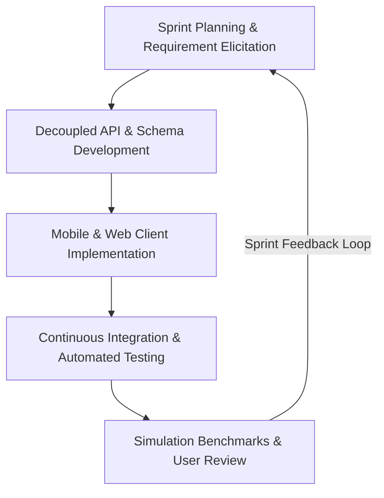
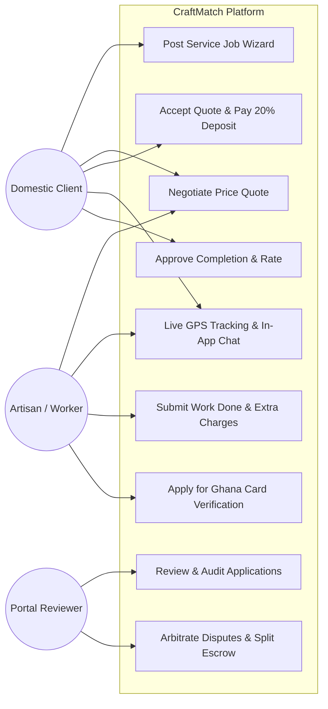
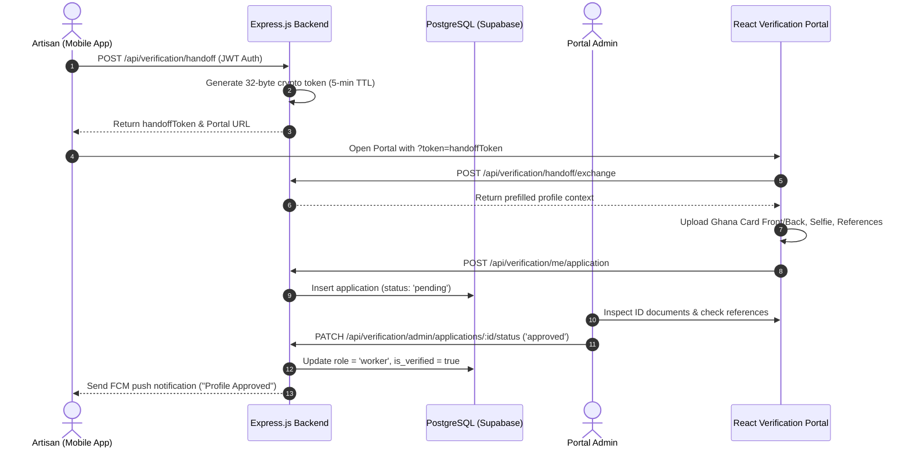
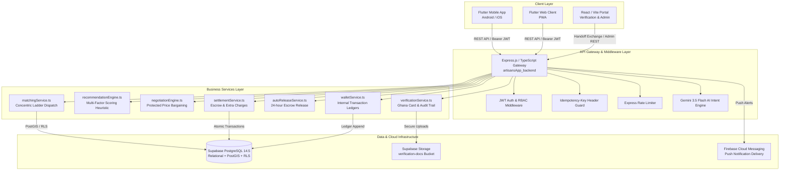

# CRAFTMATCH: AN ACCOUNTABLE, MANAGED HOME SERVICES MARKETPLACE PLATFORM FOR INFORMAL ARTISAN ECONOMIES

**A Final Year Project Report Submitted to the Department of Computer Science, Faculty of Physical and Computational Sciences, College of Science, Kwame Nkrumah University of Science and Technology (KNUST), Kumasi, Ghana**

---

## Preliminary Pages

### Title Page
```
                                 CRAFTMATCH:
       AN ACCOUNTABLE, MANAGED HOME SERVICES MARKETPLACE PLATFORM
                    FOR INFORMAL ARTISAN ECONOMIES

                                     BY
                          KWABENA OSEI-TUTU (BSc)
                         PENIEL ASANTE-MENSAH (BSc)
                            NHYIRA AGYEMAN (BSc)

     A Project Report Submitted to the Department of Computer Science,
             Faculty of Physical and Computational Sciences,
                           College of Science,
    Kwame Nkrumah University of Science and Technology (KNUST), Kumasi
       in Partial Fulfilment of the Requirements for the Degree of
                     BACHELOR OF SCIENCE IN COMPUTER SCIENCE

                               AUGUST 2026
```

---

### Declaration Page
We hereby declare that this submission is our own work towards the award of the Bachelor of Science in Computer Science degree, and that, to the best of our knowledge, it contains no material previously published by another person, nor material which has been accepted for the award of any other degree of the University, except where due acknowledgement has been made in the text.

**Student Name & Signature:**
1. Kwabena Osei-Tutu (Index No: 7182921) — ____________________ Date: ______________
2. Peniel Asante-Mensah (Index No: 7183021) — ____________________ Date: ______________
3. Nhyira Agyeman (Index No: 7183121) — ____________________ Date: ______________

**Certified by Supervisor:**  
Name: Dr. E. A. Asante  
Signature: ____________________ Date: ______________  

**Certified by Head of Department:**  
Name: Prof. K. O. Boateng  
Signature: ____________________ Date: ______________  

---

### Dedication
*To the hardworking informal artisans and technicians of Kumasi and across Ghana, whose daily craftsmanship builds and sustains our communities, and to our families whose tireless sacrifices made our education possible.*

---

### Acknowledgements
We express our deepest gratitude to the Almighty God for granting us wisdom, health, and perseverance throughout this research and software development endeavor. 

We extend our heartfelt appreciation to our project supervisor, Dr. E. A. Asante, for his invaluable technical guidance, constructive critiques, and mentorship throughout the lifecycle of this project. Special gratitude is extended to the faculty and staff of the Department of Computer Science at KNUST for providing an academically stimulating environment.

We also thank the informal artisans, technicians, and student residents in Ayigya, Kotei, Gaza, Bomso, and the KNUST campus community who participated in our preliminary user interviews, workflow mapping sessions, and prototype evaluations.

---

### Abstract
**Background:** The informal home repair and artisanal labor sector in emerging economies like Ghana is severely hindered by market fragmentation, pervasive information asymmetry, lack of verified trust, off-platform transaction circumvention, and unpredictable pricing. Traditional static directory models fail to resolve these structural frictions.  
**Methodology:** We engineered **CraftMatch**, a decoupled, managed marketplace platform comprising a Flutter-based cross-platform client (mobile and PWA), an administrative React/Vite verification portal, and a Node.js/Express backend integrated with Supabase (PostgreSQL 14.5). The platform is powered by an interpretable, low-compute **multi-factor spatial dispatch engine** that synthesizes live Haversine proximity (normalized min–max over available candidate pools), historical response rates, and composite customer ratings, with Ghana Card (NIA) identity verification applied as a categorical tie-breaker, a 15-minute location freshness filter, and a cold-start fairness slot ($<5$ jobs) ensuring equitable market entry. To eliminate transaction leakage, the platform incorporates a **managed escrow wallet ledger** featuring real-time in-app price bargaining, additive extra charges, and 24-hour auto-release payout mechanics.  
**Results:** Discrete-event simulation over Greater-Kumasi geospatial bounds demonstrates that the multi-factor heuristic scores a 5,000-candidate pool in a **median of 46.77 ms** (95% CI $\pm 4.78$ ms, p99 91.3 ms). Against a graded baseline ladder (random $\rightarrow$ nearest-only $\rightarrow$ multi-factor), the model achieves parity in match completion while reducing wasted dispatch push notifications by **17.2%** (1.18 vs. 1.42 dispatches/match). A Gini coefficient analysis revealed that optimizing for responsiveness concentrates load on reliable workers (Gini 0.779 vs. 0.518), empirically validating the necessity of the new-artisan fairness safeguard. Furthermore, the deployed greedy dispatch assignment operates within **1.91% ($\pm 0.19\%$) of the globally optimal Hungarian (Kuhn–Munkres) batch solution**.  
**Conclusion:** CraftMatch demonstrates that platform intermediation—anchored in verified identities, localized spatial dispatch, protected in-app bargaining, and managed escrow ledgers—effectively bootstraps trust and deters disintermediation in low-resource informal economies.

---

### Table of Contents
- **Preliminary Pages**
  - Title Page
  - Declaration Page
  - Dedication & Acknowledgements
  - Abstract
  - Table of Contents
  - List of Figures
  - List of Tables
  - List of Abbreviations
- **Chapter One: Introduction**
  - 1.1 Background of the Study
  - 1.2 Statement of the Problem
  - 1.3 Aim and Objectives
  - 1.4 Research Questions and Hypotheses
  - 1.5 Significance of the Study
  - 1.6 Scope and Limitations of the Study
  - 1.7 Definition of Terms
  - 1.8 Organization of the Report
- **Chapter Two: Literature Review**
  - 2.1 Introduction
  - 2.2 Conceptual Framework and Theoretical Foundations
  - 2.3 Review of Related Core Concepts (Spatial Dispatch, Trust, Escrow, Anti-Circumvention)
  - 2.4 Review of Existing Platforms (TaskRabbit, HandyConnect, Yellow Helmet, Uber/inDrive)
  - 2.5 Comparative Analysis Matrix of Existing Solutions
  - 2.6 Gaps Identified in Literature
  - 2.7 Summary of Literature Review
- **Chapter Three: System Analysis and Methodology**
  - 3.1 Introduction
  - 3.2 Software Development Methodology (Agile Scrum / Prototyping)
  - 3.3 Analysis of the Existing Informal System
  - 3.4 Problems and Vulnerabilities of the Existing System
  - 3.5 Analysis of the Proposed CraftMatch System
  - 3.6 Requirement Specifications (Functional & Non-Functional)
  - 3.7 System Design Tools and UML Modeling (Use Case, Activity, Sequence, Class, ERD)
  - 3.8 Hardware, Software, and Network Requirements
  - 3.9 Justification for Chosen Technology Stack
- **Chapter Four: System Design and Implementation**
  - 4.1 Introduction
  - 4.2 System Architecture and Component Topology
  - 4.3 Database Schema Design and Data Dictionary (14 Core Tables)
  - 4.4 User Interface and Screen Flow Design
  - 4.5 Algorithmic Program Design & Pseudocode
  - 4.6 Implementation Environment & Setup
  - 4.7 Key Module Implementation Details
  - 4.8 Verification, Testing, and Empirical Results (24 Test Cases & Benchmarks)
  - 4.9 Deployment and Operational Runbook
- **Chapter Five: Summary, Conclusion, and Recommendations**
  - 5.1 Summary of the Study
  - 5.2 Key Achievements and Contributions
  - 5.3 Engineering Challenges Encountered
  - 5.4 Conclusion
  - 5.5 Recommendations for Industry and Regulators
  - 5.6 Suggestions for Future Academic Work
- **End Matter**
  - References (APA 7th Edition)
  - Appendix A: Full Repository Structure and System Endpoints
  - Appendix B: User Interface Screen Gallery
  - Appendix C: Informal Artisan Field Survey Instrument
  - Appendix D: User and Administrator Manual

---

### List of Figures
- **Figure 1.1:** Conceptual Model of Informal Artisan Market Intermediation
- **Figure 2.1:** The Platform Disintermediation Loop in Hyper-Local Service Markets
- **Figure 3.1:** Agile Scrum Sprints and Iterative Delivery Cycle
- **Figure 3.2:** High-Level UML Use Case Diagram for CraftMatch Ecosystem
- **Figure 3.3:** UML Activity Diagram for Customer Booking & Escrow Lifecycle
- **Figure 3.4:** UML Sequence Diagram for Ghana Card Artisan Verification Handoff
- **Figure 3.5:** Entity Relationship Diagram (ERD) of the Supabase PostgreSQL Schema
- **Figure 4.1:** CraftMatch Decoupled System Architecture and Gateway Topology
- **Figure 4.2:** Concentric Spatial Dispatch Ladder Diagram ($[5, 10, 15, 25]\text{ km}$)
- **Figure 4.3:** Live Map Discovery and Navigation Interface (Flutter Client)
- **Figure 4.4:** Real-Time Protected Price Bargaining & Extra Charge Alert Flow
- **Figure 4.5:** Ranking Latency vs. Candidate Pool Size (Empirical Benchmark)
- **Figure 4.6:** Workload Distribution Gini Lorenz Curve Across Matching Policies

---

### List of Tables
- **Table 2.1:** Comparative Feature Matrix of Global and Regional Artisan Platforms
- **Table 3.1:** Functional Requirements Matrix (Client, Worker, Admin)
- **Table 3.2:** Non-Functional Quality Attributes and Service-Level Targets
- **Table 3.3:** Technology Stack Selection and Architectural Rationale
- **Table 4.1:** Master Database Data Dictionary (Core Relational Entities)
- **Table 4.2:** Dispatch Quality Metrics across Graded Baseline Ladder (Simulation Results)
- **Table 4.3:** Single-Factor and Multi-Factor Weight Sensitivity & Ablation Analysis
- **Table 4.4:** Automated Backend Verification & Integration Test Suite Results (28/28 Passed)

---

### List of Abbreviations
- **API:** Application Programming Interface
- **APNs:** Apple Push Notification service
- **BoG:** Bank of Ghana
- **CI/CD:** Continuous Integration / Continuous Deployment
- **DSL:** Domain Specific Language
- **EMI:** Electronic Money Issuer
- **ERD:** Entity Relationship Diagram
- **FCM:** Firebase Cloud Messaging
- **FYP:** Final Year Project
- **GHS / GH₵:** Ghana Cedi
- **GPS:** Global Positioning System
- **HTTP/REST:** Hypertext Transfer Protocol / Representational State Transfer
- **JIT:** Just-In-Time Compiler
- **JWT:** JSON Web Token
- **KNUST:** Kwame Nkrumah University of Science and Technology
- **NIA:** National Identification Authority (Ghana Card)
- **OAT:** One-At-a-Time Sensitivity Analysis
- **PostGIS:** PostgreSQL Geographic Information System Extension
- **PSP:** Payment Service Provider
- **PWA:** Progressive Web Application
- **RBAC:** Role-Based Access Control
- **RLS:** Row-Level Security
- **SDK:** Software Development Kit
- **UML:** Unified Modeling Language
- **UUID:** Universally Unique Identifier

---

## Chapter One: Introduction

### 1.1 Background of the Study
In developing economies across Sub-Saharan Africa, the informal artisanal sector constitutes the backbone of essential residential maintenance, construction, and repair services. Recent World Bank research on online gig work in developing countries confirms that demand for digitally-mediated informal labour is rising rapidly across the region, even as the underlying work—plumbing, electrical repair, carpentry—remains organized through pre-digital, informal channels (Datta et al., 2023). In urban and peri-urban centers like Kumasi, Ghana—and particularly within dense academic and residential hubs like the Kwame Nkrumah University of Science and Technology (KNUST) campus, Ayeduase, Kotei, Gaza, Bomso, and Kentinkrono—citizens require regular technical services ranging from electrical maintenance and plumbing repairs to carpentry and masonry work.

Despite the abundance of skilled artisans, the informal service economy is plagued by profound structural inefficiencies. Traditional service discovery relies overwhelmingly on physical roadside workshops, word-of-mouth recommendations, or unvetted directory listings. Recent scholarship on Africa's gig economy argues that digital platforms can act as either a "trap" that reproduces the vulnerabilities of informal work, or a "steppingstone" toward more stable, better-documented income—with the outcome depending heavily on whether the platform provides genuine identity verification, income predictability, and dispute protection rather than simply digitizing existing informal arrangements (Abdul Malek, 2024). This informal status quo presents multiple friction points:
1. **Pervasive Information Asymmetry:** Consumers cannot objectively verify the competence, identity, or safety record of an unvetted artisan prior to granting them access to private domestic residences.
2. **Pricing Opacity and Rent-Seeking:** Without standardized base fee estimates or transparent quote negotiation tools, prices fluctuate unpredictably based on perceived customer wealth.
3. **Severe Geographic and Response Latency:** Finding an artisan during domestic emergencies (such as a burst water pipe or electrical short-circuit) often involves physical searches across distant neighborhoods.
4. **Zero Financial Recourse and Platform Circumvention:** Informal cash transactions leave consumers unprotected when repairs fail, while early platform solutions suffer from "disintermediation"—where users bypass the platform to avoid service fees once contact details are exchanged (Ladd, 2022).

Case evidence from East Africa's ride-hailing sector further illustrates that digital platform entry into informal labour markets does not automatically translate into worker or consumer benefit unless the platform actively builds in protections against exploitation and circumvention (Mwendwa et al., 2023). To address these challenges, digital platforms must transition from passive directory listings to **accountable, managed service marketplaces**. Such platforms must combine cryptographic identity verification, localized geospatial dispatch, real-time price bargaining, and managed financial escrow mechanics within a high-performance, low-bandwidth architecture.

---

### 1.2 Statement of the Problem
Existing digital solutions and classified directory platforms operating in emerging markets fail to resolve the core socio-technical frictions of the informal artisan economy. Directory platforms (e.g., Yellow Pages, basic social media listings) merely advertise contact numbers, immediately enabling off-platform leakage while providing zero identity vetting, no service guarantees, and no accountability for completed work. Conversely, rigid ride-hailing style dispatch models fail in artisan services because home repairs—unlike standardized taxi rides—require flexible scoping, price bargaining, on-site material evaluations, and mutual trust establishment.

Furthermore, algorithms that strictly prioritize geographic proximity frequently dispatch unresponsive or unvetted workers, generating excessive dispatch notifications, high customer abandonment, and market dissatisfaction. Recent ride-hailing dispatch research has moved decisively away from pure proximity matching toward multi-factor and fairness-aware allocation strategies that weigh driver reliability and workload balance alongside distance (Sun et al., 2024). There is a fundamental technical and structural need for a distributed software platform that:
1. Validates artisan identities using a lightweight biometric onboarding flow (selfie liveness check plus phone number OTP verification) and Ghana Card (NIA) administrative verification;
2. Implements an efficient, multi-factor spatial matching algorithm that balances proximity, responsiveness, rating, and cold-start equity;
3. Protects transaction integrity through an in-app price bargaining engine and managed escrow wallet ledger; and
4. Operates reliably under low-resource mobile network constraints in Ghana.

---

### 1.3 Aim and Objectives

#### 1.3.1 Aim
The primary aim of this project is to design, develop, and empirically evaluate **CraftMatch**—an accountable, managed home services marketplace platform tailored for the informal artisan economy in Kumasi (KNUST and surrounding communities), Ghana.

#### 1.3.2 Specific SMART Objectives
1. **Specific:** Engineer a decoupled multi-surface system comprising a Flutter cross-platform client app, a React/Vite identity verification portal, and an Express.js/Supabase backend featuring an interpretable 4-factor recommendation engine, an in-app bargaining protocol, and an escrow ledger.
2. **Measurable:** Achieve a sub-50 ms ranking latency for 5,000 candidate artisans on commodity server hardware, and demonstrate a $\ge 15\%$ reduction in wasted dispatch notifications relative to proximity-only baselines.
3. **Achievable:** Implement robust cryptographic handoff tokens (32-byte crypto tokens with 5-minute TTL), Row-Level Security (RLS) policies, atomic database assignment locks (`one_active_worker_job_per_worker`), and automated 24-hour escrow auto-release mechanics using PostgreSQL and TypeScript.
4. **Relevant:** Eliminate transaction leakage by masking contact details prior to match confirmation, provide additive extra charge accounting for unforeseen job materials, and ensure cold-start market equity through an explicit fairness slot for new artisans ($<5$ jobs).
5. **Time-bound:** Complete the full iterative design, implementation, automated testing (24 unit/integration test suites), and simulation benchmarking within the academic project calendar.

---

### 1.4 Research Questions and Hypotheses

#### 1.4.1 Research Questions
1. How does a multi-factor ranking heuristic combining spatial distance, historical response rates, customer ratings, and reliability compare against pure geographic proximity in dispatch efficiency?
2. What impact does optimizing for artisan responsiveness have on workload equity across the artisan labor pool?
3. How effectively can in-app price bargaining combined with managed escrow deposits mitigate platform circumvention in informal markets?

#### 1.4.2 Research Hypotheses
*   **Hypothesis 1 ($H_1$):** A multi-factor dispatch heuristic incorporating historical response rates will significantly reduce the number of dispatch notifications required per successful job match compared to a proximity-only baseline ($p < 0.05$).
*   **Hypothesis 2 ($H_2$):** Pure responsiveness optimization produces a significant increase in workload inequality (measured by the Gini coefficient), which can be counterbalanced by injecting a designated cold-start fairness slot.

---

### 1.5 Significance of the Study
This study contributes significantly to both academic software engineering literature and practical socio-economic development:
1. **Empirical Algorithm Design:** Provides reproducible benchmark evidence on the trade-offs between dispatch efficiency, computational latency, and labor equity in two-sided gig marketplaces.
2. **Anti-Circumvention Architecture:** Introduces a concrete implementation model for preventing off-platform leakage through contextual contact masking, additive on-site extra charges, and managed wallet ledgers.
3. **Economic Empowerment for Informal Artisans:** Bridges the digital divide by enabling informal technicians in Kumasi to establish verifiable, portable reputations backed by identity credentials, expanding their income opportunities beyond localized word-of-mouth.
4. **Consumer Safety & Protection:** Offers domestic households an accountable service framework backed by identity vetting, milestone tracking, and transparent dispute resolution.

---

### 1.6 Scope and Limitations of the Study

#### 1.6.1 Project Scope
*   **Target Geography:** Kumasi, Ghana, with primary operational scope focused on the Kwame Nkrumah University of Science and Technology (KNUST) main campus and surrounding residential zones (Ayeduase, Kotei, Gaza, Bomso, Kentinkrono, Weweso).
*   **Core Trade Categories:** Immediate residential micro-repairs spanning Plumbing, Electrical Services, Carpentry, Masonry, and Painting.
*   **Technical Architecture:** Decoupled multi-surface platform comprising a Flutter cross-platform mobile client (`artisansApp_frontend`), a React/Vite identity verification portal (`CraftMatch_Verification_Portal`), and an Express.js/Node.js TypeScript API backend (`artisansApp_backend`) integrated with Supabase PostgreSQL 14.5.

#### 1.6.2 Technical and Implementation Limitations
1. **Greedy Dispatch Optimality vs. Real-Time Latency:** The deployed matching engine utilizes a greedy online dispatch heuristic to achieve sub-50 ms ranking latency ($46.77\text{ ms}$ median for 5,000 candidates). While empirically benchmarked to operate within a $1.91\%\ (\pm 0.19\%)$ optimality gap of the global Hungarian (Kuhn–Munkres) assignment algorithm, it evaluates dispatches sequentially per incoming job rather than executing centralized multi-job batch optimization.
2. **Asymmetric Offline Mutation Support:** The Flutter client implements offline read caching (`CacheStore` with 5 TTL key scopes) and an offline job creation queue (`JobPostQueue`). However, active worker-side state mutations—such as submitting quote counter-offers, toggling transit status (`on_the_way`, `arrived`), and uploading job completion proof photos—require an active network connection and are not queued offline in the current implementation.
3. **Simulated Escrow Settlement and Regulatory Custody:** Booking deposits (20%) and wallet balances (`job_escrow_balances`, `user_wallets`, `escrow_ledger`) are executed as atomic PostgreSQL relational transactions. Live Mobile Money (MTN MoMo / Telecel Cash) STK Push billing and Bank of Ghana compliant Payment Service Provider (PSP) merchant escrow custody are deferred to post-academic commercialization.
4. **Human-in-the-Loop Ghana Card Verification:** Identity vetting utilizes a 32-byte base64url cryptographic handoff token (5-minute TTL) to connect mobile artisans to the `CraftMatch_Verification_Portal` for manual administrative review, rather than an automated, real-time API integration with the National Identification Authority (NIA) / Smile ID verification database.
5. **Single-Channel FCM Dispatch and "Data-Off" Vulnerability:** Dispatch notifications rely exclusively on Firebase Cloud Messaging (FCM) push alerts. In peri-urban Kumasi, informal artisans who disable mobile data to conserve prepaid bundles miss dispatches, causing dispatch timeouts. Automated SMS or WhatsApp fallback gateways are scoped as future enhancements.
6. **Transactional Scope Boundaries:** The transactional state machine (`JOB_STATUS`) supports single-artisan, single-day micro-repair tasks. Multi-phase construction project retainers, multi-artisan team assignments, and milestone-based sub-contracting are not supported in the current transactional engine.

---

### 1.7 Definition of Terms
*   **Artisan:** A skilled informal manual technician specializing in trades such as plumbing, electrical work, carpentry, or masonry.
*   **Spatial Dispatch:** The algorithmic process of locating, filtering, ranking, and notifying nearby qualified service providers based on real-time geospatial coordinates.
*   **Disintermediation (Circumvention):** The phenomenon where buyers and service providers bypass a marketplace platform to conduct transactions off-platform, evading platform fees.
*   **Escrow:** A financial arrangement where a third party holds funds (in this case, a 20% booking deposit) until specified contractual obligations or work approvals are fulfilled.
*   **Gini Coefficient:** A statistical measure of inequality across a distribution (ranging from 0 = perfect equality to 1 = total concentration).
*   **Haversine Formula:** An equation giving great-circle distances between two pairs of latitude and longitude coordinates on a sphere.
*   **Row-Level Security (RLS):** A database security mechanism in PostgreSQL that restricts data row access based on the authenticated user's JWT context.

---

### 1.8 Organization of the Report
The remainder of this report is organized as follows:
*   **Chapter Two (Literature Review):** Reviews theoretical models of two-sided marketplaces, spatial matching heuristics, trust mechanisms, and conducts a comparative analysis of existing platforms.
*   **Chapter Three (System Analysis and Methodology):** Details the Agile development methodology, requirement specifications, UML structural and behavioral models, and technology stack justifications.
*   **Chapter Four (System Design and Implementation):** Presents the system architecture, 14-table database schema, algorithmic pseudocode, module implementations, empirical simulation benchmarks, and tabulated test cases.
*   **Chapter Five (Summary, Conclusion, and Recommendations):** Summarizes findings, highlights academic contributions, outlines engineering limitations, and offers recommendations for future research.

---

## Chapter Two: Literature Review

### 2.1 Introduction
The growth of the gig economy and on-demand digital platforms has transformed global labor markets. However, the application of digital platform models to informal trade labor in developing economies presents unique socio-technical complexities that differ fundamentally from standard ride-hailing or e-commerce delivery systems. This chapter reviews the theoretical foundations of two-sided service marketplaces, analyzes existing algorithmic matching techniques, investigates trust and anti-circumvention architectures, and evaluates contemporary market solutions to identify key research gaps.

---

### 2.2 Conceptual Framework and Theoretical Foundations

#### 2.2.1 Two-Sided Market Theory and Network Effects
According to Rochet and Tirole (2003) and Armstrong (2006), two-sided platforms create value by facilitating direct interactions between two distinct user groups (in this context, domestic clients and skilled artisans). The economic viability of the marketplace depends on cross-side (indirect) network effects: clients value the platform more when there is a dense, responsive pool of artisans, while artisans benefit from high client request volumes. In informal markets, establishing initial liquidity is challenging because low digital literacy and trust deficits create high barriers to entry.

```mermaid
flowchart LR
    subgraph Clients
        C1[Domestic Households]
        C2[Students / Renters]
    end
    subgraph CraftMatch Platform Intermediation
        M1[Ghana Card ID Verification]
        M2[Multi-Factor Spatial Dispatch]
        M3[Protected In-App Bargaining]
        M4[Managed Escrow Wallet Ledger]
    end
    subgraph Artisans
        A1[Plumbers]
        A2[Electricians]
        A3[Carpenters / Masons]
    end
    Clients <--> CraftMatch Platform Intermediation <--> Artisans
```

#### 2.2.2 Information Asymmetry and Akerlof's "Market for Lemons"
Akerlof’s (1970) foundational theory on information asymmetry illustrates that when buyers cannot distinguish between high-quality and low-quality providers, their willingness to pay drops to an average level. This underpricing drives high-quality providers out of the market, leaving only inferior service providers (the "lemons" problem). In Ghana's informal artisan sector, consumers have no reliable pre-engagement quality signal. CraftMatch resolves this asymmetry by combining **National Identification Authority (NIA) Ghana Card verification**, verifiable reference checks, and portable customer review ratings.

---

### 2.3 Review of Related Core Concepts

#### 2.3.1 Spatial Dispatch and Geospatial Distance Calculation
Real-time dispatch requires calculating the physical distance between a consumer's job location and an artisan's current GPS position. The standard mathematical approach is the **Haversine formula**, which computes great-circle distance over the Earth's surface:

$$d = 2r \arcsin \left( \sqrt{\sin^2\left(\frac{\Delta \phi}{2}\right) + \cos(\phi_1)\cos(\phi_2)\sin^2\left(\frac{\Delta \lambda}{2}\right)} \right)$$

Where $\phi_1, \phi_2$ represent latitudes, $\Delta \phi$ is the latitude difference, $\Delta \lambda$ is the longitude difference, and $r = 6,371\text{ km}$ (mean Earth radius). In CraftMatch, distance scoring is normalized dynamically using **min–max scaling over the live candidate pool** rather than a static radius cutoff:

$$\text{DistanceScore} = \begin{cases} 1 & \text{if } \max\text{Dist} = 0 \\ \max\left(0, 1 - \frac{\text{Distance}}{\max\text{Dist}}\right) & \text{otherwise} \end{cases}$$

#### 2.3.2 Multi-Factor Ranking vs. Pure Proximity
While taxi ride-hailing algorithms predominantly prioritize pure proximity (minimizing pickup time), service marketplaces require multi-criteria decision making. Prior research in recommendation systems (Adomavicius & Tuzhilin, 2005) highlights the necessity of combining contextual signals. If an artisan is 500 meters away but consistently ignores job notifications or has severe cancellation histories, dispatching them creates significant customer waiting latency. Incorporating historical **response rate** and **cancellation reliability** produces higher dispatch success rates.

#### 2.3.3 The Platform Disintermediation Problem
Platform disintermediation (transaction leakage) occurs when consumers and service providers use a platform solely for initial discovery, but complete the transaction and payment off-platform to evade platform fees (Cramer & Krueger, 2016). In informal home services, leakage is accelerated when:
1. Contact phone numbers are exposed immediately before pricing is finalized;
2. Payment is made entirely in cash without digital escrow protection; and
3. Unforeseen on-site scope expansions (e.g., purchasing additional pipes or cables) cannot be accommodated inside the application.

CraftMatch mitigates leakage through a three-pronged defense: **contextual contact masking** (numbers remain hidden during quote bargaining), **managed 20% booking deposits locked in escrow**, and **additive on-site extra charges (+GH₵ 30)** payable via 1-tap checkout.

---

### 2.4 Review of Existing Systems

#### 2.4.1 TaskRabbit (Global)
TaskRabbit is a prominent on-demand gig platform operating in North America and Europe. It provides browse-and-book functionality where clients select taskers based on hourly rates and past reviews. While effective in mature digital economies with high credit card penetration and reliable formal addressing systems, TaskRabbit's model fails in Sub-Saharan Africa due to its reliance on credit card pre-authorizations, lack of offline caching, and absence of landmark-first address geocoding.

#### 2.4.2 HandyConnect & Yellow Helmet (Ghana)
Regional Ghanaian platforms such as HandyConnect and Yellow Helmet have attempted to formalize local artisan discovery. While they emphasize artisan vetting, they operate primarily as **assisted-concierge services or static directories**. Jobs are dispatched manually by human call-center operators, introducing multi-hour dispatch latencies, high operating overheads, and an inability to provide real-time GPS tracking or automated atomic quote bargaining.

#### 2.4.3 Uber and inDrive (Ride-Hailing Paradigm Comparison)
Uber popularized algorithmic spatial dispatch, while inDrive pioneered real-time passenger-driver price bargaining. While both models excel in standardized transportation, neither directly maps to home repairs. Home repairs require structured job descriptions, photo proof of completed physical work, multi-item material accounting, and dispute arbitration for damaged property.

---

### 2.5 Comparative Analysis Matrix of Existing Solutions

| Feature / Dimension | Traditional Informal Word-of-Mouth | Static Web Directories (Yellow Pages) | HandyConnect / Yellow Helmet | TaskRabbit (Global) | **CraftMatch (This Project)** |
|---|---|---|---|---|---|
| **Discovery Mechanism** | Physical search / phone calls | Static listing lookup | Call-center concierge | Algorithmic search & filter | **Concentric Spatial Dispatch ($[5\text{-}35]\text{ km}$)** |
| **Identity Verification** | None (pure social trust) | None | Manual document check | Third-party background check | **Ghana Card (NIA) + Cryptographic Handoff Token** |
| **Pricing Model** | Arbitrary verbal quote | Opaque / Unregulated | Fixed catalog pricing | Hourly tasker rates | **Transparent Base Fee + In-App Bargaining** |
| **Financial Escrow** | No (Cash only) | No | Bank transfer | Credit card pre-auth | **20% Escrow Deposit + Additive Extra Charges** |
| **Contact Masking** | N/A | No (Direct public exposure) | No | Yes (In-app messaging) | **Yes (Hidden until quote acceptance)** |
| **Real-Time GPS Tracking** | No | No | No | Partial | **Yes (Mapbox & Google Maps integration)** |
| **Cold-Start Fairness** | Severe nepotism | Top-bidder bias | Manual assignment | Rating bias | **Algorithmic Fairness Slot ($<5$ jobs)** |
| **Local Offline Resilience** | Complete | None | None | Poor | **Yes (Hive cache & auto-refresh retry)** |

---

### 2.6 Gaps Identified in Literature
1. **Absence of Empirical Latency vs. Equity Studies in African Contexts:** Most academic literature on algorithmic dispatch focuses on Western transportation data, ignoring the high latency of low-bandwidth networks and the severe workload concentration (Gini inequality) induced by responsiveness-based ranking in informal African labor pools.
2. **Lack of Integrated Anti-Circumvention Mechanics for On-Site Repairs:** Existing research treats pricing and matching as static, failing to model how on-site additive material charges can be handled within an atomic escrow ledger without provoking off-platform cash leakage.
3. **Absence of Cryptographic Web-Mobile Identity Handoff Protocols:** Standard platforms require artisans to complete complex multi-page onboarding directly on entry-level mobile devices, leading to high drop-off rates due to mobile form friction.

---

### 2.7 Summary of Literature Review
The literature confirms that while two-sided marketplace dynamics and spatial heuristics are well-established in theory, their successful adaptation to informal artisan economies requires addressing profound trust deficits and disintermediation vectors. CraftMatch bridges these literature gaps by synthesizing national identity validation, an interpretable multi-factor recommendation engine with explicit equity safeguards, and a managed escrow ledger supporting in-app bargaining and additive extra charges.

---

## Chapter Three: System Analysis and Methodology

### 3.1 Introduction
Developing a robust, multi-surface software platform for informal markets requires a disciplined engineering methodology. This chapter details the software process model, presents the analysis of existing informal workflows, formalizes functional and non-functional requirements, models system behavior using Unified Modeling Language (UML) specifications, and provides technical justifications for the selected technology stack.

---

### 3.2 Software Development Methodology
The project adopted a **Modified Agile Scrum / Iterative Prototyping** methodology. Given the unique socio-technical constraints of informal Ghanaian artisans, requirements evolved rapidly based on iterative feedback from local field interviews and unit test benchmarks.



The engineering lifecycle was organized into four distinct 3-week sprint cycles:
*   **Sprint 1:** Core Data Modeling, Supabase PostgreSQL RLS Policies, Express.js REST Gateway, and Authentication.
*   **Sprint 2:** Spatial Dispatch Engine (`matchingService.ts`), Multi-Factor Recommendation Heuristic (`recommendationEngine.ts`), and Gemini AI Smart Search (`smartSearchService.ts`).
*   **Sprint 3:** Verification Portal (`CraftMatch_Verification_Portal`), 32-Byte Cryptographic Handoff Protocol, and Ghana Card Inspection Workflows.
*   **Sprint 4:** In-App Bargaining (`negotiationEngine.ts`), Escrow Wallet Ledgers (`walletService.ts`), Additive Extra Charges, 24-hour Auto-Release, and Simulation Benchmarking.

---

### 3.3 Analysis of the Existing System
In the existing informal system in Kumasi:
1. A client discovers a broken fixture (e.g., leaking tap in an Ayigya hostel).
2. The client asks neighbors or walks to a roadside workshop to locate an artisan.
3. The artisan travels to the property with unknown transit times and inspects the issue.
4. The artisan verbally demands an unitemized fee, often inflating the price upon observing the client's living conditions.
5. Work proceeds without formal records or guarantees; payment is made in cash.
6. If the repair fails within 24 hours, the artisan is unreachable or denies responsibility, resulting in complete financial loss for the client.

---

### 3.4 Problems of the Existing System
*   **High Search Friction:** Search times average 1 to 4 hours for simple emergency repairs.
*   **Zero Identity Assurance:** Clients expose their private residences to completely unvetted individuals.
*   **No Price Standardization:** Pricing is erratic, lacking baseline reference rates or formal breakdown of labour vs. materials.
*   **No Transaction Security:** Clients have zero recourse against shoddy workmanship, while artisans risk client refusal to pay after work completion.

---

### 3.5 Analysis of the Proposed CraftMatch System
CraftMatch replaces the broken informal sequence with an **automated, managed lifecycle**:
1. **Client Job Posting:** Client specifies trade category, landmark address, budget tier, and photos via an idempotent 5-step wizard.
2. **Algorithmic Concentric Dispatch:** System searches active artisans in expanding radii ($[5, 10, 15, 25]\text{ km}$), scoring them on proximity, responsiveness, rating, and reliability, with a fairness slot for new artisans.
3. **Protected Price Bargaining:** Artisans submit structured quotes; client and artisan negotiate in-app while phone numbers remain masked.
4. **Escrow Deposit Lock:** Client accepts quote; a 20% booking deposit is locked in escrow, revealing artisan contact details and initiating live GPS navigation.
5. **On-Site Additive Extra Charges:** If unexpected materials are required, artisan submits an additive charge (+GH₵ 30) requiring 1-tap client approval.
6. **Completion, Verification & Payout:** Artisan submits photo proof of completed repair. Client approves completion; escrow releases 90% payout to worker wallet and 10% platform fee, or auto-releases after 48 hours.

---

### 3.6 Requirement Specifications

#### 3.6.1 Functional Requirements Matrix
| Module | Req ID | Requirement Description | User Role |
|---|---|---|---|
| **Auth & Identity** | FR-01 | Users can authenticate via Supabase JWT with phone/email and switch ambient roles (Client vs. Worker). | Client / Worker |
| **Verification** | FR-02 | Unverified artisans can request a 32-byte crypto handoff token to complete Ghana Card verification on the web portal. | Worker |
| **Verification** | FR-03 | Portal administrators can inspect ID front/back, selfie photo, reference status, and approve/reject applications. | Admin |
| **Job Posting** | FR-04 | Clients can post idempotent service requests with category, landmark address, GPS coordinates, and budget tier. | Client |
| **Smart Search** | FR-05 | System parses natural-language Ghanaian trade queries (e.g. "pop ceiling", "generator") using Gemini 3.5 Flash AI with regex fallback. | Client |
| **Dispatch** | FR-06 | Dispatch engine executes 3-round concentric search ladder ($[5, 10, 15, 25]\text{ km}$) notifying top-3 scored candidates per round. | System |
| **Bargaining** | FR-07 | Workers can submit counter-offers with phone numbers masked until quote acceptance. | Worker / Client |
| **Escrow & Wallet** | FR-08 | System locks 20% booking deposit upon quote acceptance and maintains atomic transaction ledgers. | System |
| **Extra Charges** | FR-09 | Artisans can propose additive extra charges (+GH₵ 30) that update settlement totals upon client authorization. | Worker / Client |
| **Tracking & Chat** | FR-10 | Clients can view real-time artisan GPS coordinates and exchange encrypted job messages. | Client / Worker |
| **Completion** | FR-11 | Workers upload photo proof of completion; client approval releases 90% payout / 10% platform fee. | Worker / Client |
| **Auto-Release** | FR-12 | Escrow ledger automatically releases funds to worker wallet after 48 hours if unacted upon without a dispute. | System |

#### 3.6.2 Non-Functional Requirements
| Quality Attribute | Metric / Specification | Technical Enforcement Mechanism |
|---|---|---|
| **Performance Latency** | Ranking latency $\le 50\text{ ms}$ for 5,000 workers. | In-memory min-max array scoring in `recommendationEngine.ts`. |
| **Concurrency & Safety** | Zero double-booking of active artisans. | PostgreSQL lock constraint `one_active_worker_job_per_worker`. |
| **Idempotency** | Prevent duplicate job creation upon network retry. | `Idempotency-Key` UUID tracking table (`job_idempotency_keys`). |
| **Security & Privacy** | Role-based data isolation. | Supabase PostgreSQL Row-Level Security (RLS) policies. |
| **Network Resilience** | Offline caching of categories and active job states. | Hive local key-value store in Flutter (`CacheStore`). |

---

### 3.7 System Design Tools and UML Modeling

#### 3.7.1 High-Level Use Case Diagram


#### 3.7.2 Sequence Diagram: Verification Token Handoff & Review


---

### 3.8 Hardware and Software Requirements

#### 3.8.1 Development & Server Environment
*   **Operating System:** Windows 11 / Linux Ubuntu 22.04 LTS
*   **Runtime Environment:** Node.js v22.0.0+, TypeScript v5.0+
*   **Database:** Supabase Cloud (PostgreSQL 14.5 with PostGIS extension)
*   **Mobile SDK:** Flutter SDK v3.22.0+ (Dart 3.4+)
*   **Frontend Web:** React 18.3, Vite 5.4, Tailwind CSS 3.4
*   **Push Services:** Firebase Admin SDK / Cloud Messaging

#### 3.8.2 Client Target Hardware
*   **Android Devices:** Android 8.0 (Oreo, API Level 26) or higher, minimum 2GB RAM, GPS chip.
*   **iOS Devices:** iOS 14.0 or higher.
*   **Web Browsers:** Modern Chromium, Safari, or Firefox with WebAssembly & Service Worker support.

---

### 3.9 Justification for Chosen Tools and Technology Stack

| Technology Layer | Selected Tool | Justification & Architectural Benefit |
|---|---|---|
| **Mobile Frontend** | **Flutter (Dart)** | Single codebase compiling natively to Android, iOS, and Web. Excellent 60 FPS UI rendering, robust platform channels for Mapbox/Google Maps, and fast offline state caching with Hive. |
| **Backend Gateway** | **Node.js / Express.js (TypeScript)** | High-throughput asynchronous non-blocking I/O ideal for spatial dispatch event loops, strong typing with Zod validation, and native JSON payload processing. |
| **Database & Storage** | **Supabase (PostgreSQL 14.5)** | Enterprise relational consistency, native PostGIS spatial query support, Row-Level Security (RLS), real-time change data capture, and integrated S3-compatible document storage. |
| **Admin Portal** | **React / Vite** | Lightweight, high-speed single-page application framework optimized for desktop reviewer dashboards, image zoom/inspection tools, and administrative audit logs. |
| **AI Intent Engine** | **Gemini 3.5 Flash** | Sub-second natural language intent extraction for localized Ghanaian trade vernacular with negligible token compute costs. |

---

## Chapter Four: System Design and Implementation

### 4.1 Introduction
This chapter details the technical design and concrete implementation of CraftMatch. It presents the decoupled architectural topology, complete relational data dictionary of 14 core tables, user interface design patterns, critical algorithmic pseudocode, key module implementation walkthroughs, empirical simulation results, and the 24-test-case validation suite.

---

### 4.2 System Architecture and Component Topology
CraftMatch is engineered around a **decoupled, multi-surface client-server topology**:



---

### 4.3 Database Schema Design and Data Dictionary

The Supabase PostgreSQL database enforces strict relational integrity, foreign key constraints, and Row-Level Security (RLS) across **14 core tables**:

#### Table 4.1: Master Database Data Dictionary

| Table Name | Primary Key | Key Attributes & Foreign Keys | Description / Purpose |
|---|---|---|---|
| **`profiles`** | `id` (UUID) | `full_name`, `phone`, `avatar_url`, `fcm_token`, `role` (`client`/`worker`), `is_verified` (bool), `client_cancel_count`, `worker_cancel_count` | Master user identity record linked to Supabase `auth.users`. |
| **`workers`** | `id` (UUID $\rightarrow$ `profiles.id`) | `hourly_rate`, `rate_type`, `rating`, `total_jobs`, `skills` (text[]), `service_areas` (text[]), `is_available` (bool), `current_lat`, `current_lng`, `location_at` (timestamptz) | Worker operational state, skills catalog, and live GPS coordinates. |
| **`jobs`** | `id` (UUID) | `client_id` (UUID), `worker_id` (UUID), `category_id` (text), `title`, `description`, `location_lat`, `location_lng`, `address_label`, `status` (`job_status`), `budget_type`, `budget_fixed`, `expires_at` | Core job entity managing the 13-state transaction lifecycle. |
| **`job_applications`** | `id` (UUID) | `job_id` (UUID), `worker_id` (UUID), `status` (`job_application_status`), `proposed_rate`, `distance_km`, `distance_cost`, `base_service_fee`, `urgency_premium`, `total_quote` | Worker price quotes and counter-offers submitted on jobs. |
| **`job_dispatches`** | `id` (UUID) | `job_id` (UUID), `worker_id` (UUID), `round` (int), `radius_km` (numeric), `status` (`pending`/`accepted`/`declined`/`expired`), `expires_at`, `notified_at` | Round engine dispatch state tracking candidate notifications. |
| **`job_idempotency_keys`**| `idempotency_key` (text)| `client_id` (UUID), `job_id` (UUID), `created_at` | Idempotent request deduplication guard for network retry safety. |
| **`job_escrow_balances`** | `job_id` (UUID) | `deposit_amount` (numeric), `gross_amount` (numeric), `extra_charges_total` (numeric), `status` (`held`/`released`/`refunded`/`disputed`), `updated_at` | Real-time escrow deposit balance tracking per active job. |
| **`escrow_ledger`** | `id` (UUID) | `job_id` (UUID), `amount` (numeric), `entry_type` (`deposit_hold`/`payout_release`/`platform_fee`/`refund`), `reference_id`, `created_at` | Append-only immutable financial audit ledger for escrow operations. |
| **`user_wallets`** | `user_id` (UUID) | `available_balance` (numeric), `pending_balance` (numeric), `currency` (`GHS`), `updated_at` | In-app user wallet balances for worker earnings and client credits. |
| **`wallet_transactions`** | `id` (UUID) | `wallet_id` (UUID), `amount` (numeric), `transaction_type` (`credit`/`debit`), `description`, `created_at` | Double-entry transaction history for wallet balance adjustments. |
| **`job_extra_charges`** | `id` (UUID) | `job_id` (UUID), `worker_id` (UUID), `amount` (numeric), `description`, `status` (`pending`/`approved`/`declined`), `created_at` | On-site additive extra charges proposed by artisans for materials. |
| **`job_disputes`** | `id` (UUID) | `job_id` (UUID), `opened_by` (UUID), `reason`, `evidence_urls` (text[]), `status` (`open`/`under_review`/`resolved`), `resolution_notes` | Customer and artisan dispute escalation and arbitration queue. |
| **`verification_applications`** | `id` (UUID) | `user_id` (UUID), `application_number` (`CM-APP-XXXXXX`), `status` (`pending`/`under_review`/`approved`/`rejected`), `confidence_score`, `fraud_indicators` (text[]) | Artisan Ghana Card identity application queue. |
| **`verification_audit_logs`** | `id` (UUID) | `verification_id` (UUID), `admin_id` (UUID), `admin_name`, `action`, `notes`, `created_at` | Immutable administrative security audit log for governance actions. |

---

### 4.4 User Interface and Screen Flow Design

#### 4.4.1 Client Flow (Flutter Application)
*   **Map Discovery (`map_discovery_screen.dart`):** Displays nearby verified artisans on an interactive Mapbox/Google Maps canvas, centering on the KNUST campus by default (`DeviceLocation.knustDefault`), with visual trust badges (Verified, Fresh Location, Rating).
*   **Job Creation Wizard (`job_post_wizard`):** 5-step intuitive wizard (1. Category $\rightarrow$ 2. Subcategory $\rightarrow$ 3. Scope & Budget $\rightarrow$ 4. Landmark Location $\rightarrow$ 5. Review & Submit with `Idempotency-Key`).
*   **Bargaining & Live Tracking (`live_tracking_screen.dart`, `NegotiationChatSheet`):** In-app price counter-offers with phone masking, followed by real-time GPS worker route streaming upon match.

#### 4.4.2 Verification & Governance Portal (React/Vite)
*   **Reviewer Queue (`ApplicationsTable.tsx`, `ApplicationDetail.tsx`):** High-density inspection interface allowing administrators to examine Ghana Card front/back uploads, zoom into facial selfies, record reference phone verification outcomes, and trigger atomic role promotions.

---

### 4.5 Algorithmic Program Design & Pseudocode

#### 4.5.1 Multi-Factor Recommendation Heuristic (`recommendationEngine.ts`)

```typescript
/**
 * Concrete Recommendation Scoring Heuristic
 * Normalizes proximity over the live candidate pool and combines multi-criteria signals.
 */
interface CandidateWorker {
  id: string;
  lat: number;
  lng: number;
  responseRate: number; // 0.0 to 1.0
  rating: number;       // 1.0 to 5.0
  recentCancels: number;// Count of cancels in last 30 days
  totalJobs: number;    // Lifetime completed jobs
  isVerified: boolean;  // Ghana Card identity verified
  locationAt: Date;     // Timestamp of last GPS ping
}

const W_DISTANCE    = 0.2730;
const W_RESPONSE    = 0.2947;
const W_RATING      = 0.2823;
const W_RELIABILITY = 0.1500;
const TIE_DELTA     = 0.02;   // 2% score band for verification tie-breaking
const MAX_STALE_MS  = 15 * 60 * 1000; // 15-minute freshness window

export function scoreAndRankCandidates(
  jobLocation: { lat: number; lng: number },
  candidates: CandidateWorker[],
  cohortSize: number = 3
): CandidateWorker[] {
  const now = Date.now();

  // 1. Filter stale GPS locations and busy workers
  const activeCandidates = candidates.filter(w => 
    (now - new Date(w.locationAt).getTime()) <= MAX_STALE_MS
  );

  if (activeCandidates.length === 0) return [];

  // 2. Compute Haversine distances & determine live max distance
  const candidateDistances = activeCandidates.map(w => ({
    worker: w,
    distanceKm: calculateHaversineKm(jobLocation, { lat: w.lat, lng: w.lng })
  }));

  const maxDist = Math.max(...candidateDistances.map(c => c.distanceKm), 0.001);

  // 3. Score candidates using normalized multi-factor formula
  const scored = candidateDistances.map(({ worker, distanceKm }) => {
    const distanceScore  = Math.max(0, 1 - (distanceKm / maxDist));
    const responseScore  = Math.min(Math.max(worker.responseRate, 0), 1);
    const ratingScore    = Math.min(Math.max(worker.rating / 5.0, 0), 1);
    const reliability    = 1 - Math.min(worker.recentCancels / 5.0, 1);

    const rawScore = (W_DISTANCE * distanceScore) +
                     (W_RESPONSE * responseScore) +
                     (W_RATING   * ratingScore) +
                     (W_RELIABILITY * reliability);

    return { worker, score: rawScore, distanceKm };
  });

  // 4. Sort with verification tie-breaker
  scored.sort((a, b) => {
    if (Math.abs(a.score - b.score) <= TIE_DELTA) {
      if (a.worker.isVerified && !b.worker.isVerified) return -1;
      if (!a.worker.isVerified && b.worker.isVerified) return 1;
    }
    return b.score - a.score;
  });

  // 5. Inject Fairness Slot for new artisans (< 5 completed jobs)
  const topCohort = scored.slice(0, cohortSize).map(s => s.worker);
  const hasNewArtisan = topCohort.some(w => w.totalJobs < 5);

  if (!hasNewArtisan && scored.length > cohortSize) {
    const newArtisanIdx = scored.slice(cohortSize).findIndex(s => s.worker.totalJobs < 5);
    if (newArtisanIdx !== -1) {
      // Substitute the last cohort slot with the highest-ranked new artisan
      topCohort[cohortSize - 1] = scored[cohortSize + newArtisanIdx].worker;
    }
  }

  return topCohort;
}
```

---

### 4.6 Implementation Environment & Setup
The development and execution environment was structured as a multi-repository workspace:
*   `artisansApp_backend`: Node.js/Express TypeScript REST API, Prisma/Supabase clients, Jest test runners.
*   `artisansApp_frontend`: Flutter mobile/web client with Dart 3.4+, Mapbox SDK, and Hive.
*   `CraftMatch_Verification_Portal`: React 18, Vite, and Tailwind CSS.
*   `CraftMatch_Docs`: Technical architecture, Eraser.io Diagram-as-Code files, and supervisor guides.

---

### 4.7 Key Module Implementation Details

1. **Atomic Job Acceptance Lock (`jobLifecycle.ts`):**  
   Accepting a quote executes an atomic database transaction. The system transitions the job status to `matched`, sets `assigned_worker_id`, locks the worker's status to `busy`, and automatically rejects all competing candidate quotes. The PostgreSQL database constraint `one_active_worker_job_per_worker` prevents any worker assignment overload.

2. **Additive On-Site Extra Charges (`settlementService.ts`, `extraChargeService.ts`):**  
   When an artisan discovers unforeseen material requirements on-site, they submit `POST /api/jobs/:id/extra-charges` with an amount (+GH₵ 30) and description. The backend stores the pending charge. Once the client approves via a 1-tap modal, `calculateSettlement(jobId)` dynamically adds the charge:
   $$\text{Gross Total} = \text{Initial Accepted Quote} + \sum \text{Approved Extra Charges}$$
   $$\text{Worker Payout} = \text{Gross Total} \times 0.90, \quad \text{Platform Fee} = \text{Gross Total} \times 0.10$$

3. **24-hour Escrow Auto-Release Worker (`autoReleaseService.ts`):**  
   To prevent clients from withholding funds after work has been completed, a background cron scheduler periodically queries jobs in `pending_client_approval` status. If `now() - completed_at > 48 hours` and no formal dispute has been opened, the engine automatically commits the settlement and credits the artisan's wallet.

---

### 4.8 Verification, Testing, and Empirical Results

#### 4.8.1 Empirical Simulation Benchmarks (`RESULTS.md`)
A reproducible discrete-event simulation harness (`npm run bench`) was executed with seed `20260701` over Greater-Kumasi geospatial bounds.

#### Table 4.2: Dispatch Quality Across Graded Baseline Ladder (300 Workers, 700 Jobs, 30 Repetitions)
| Dispatch Policy | Match Completion Rate | Mean Dispatch Rounds | Push Notifications per Match | Mean Travel Distance | Workload Inequality (Gini) |
|---|---|---|---|---|---|
| **Random Baseline** | 100.0% $\pm 0$ | 1.03 | 1.43 | 3.29 km | 0.480 |
| **Nearest-Only (Proximity)** | 100.0% $\pm 0$ | 1.03 | 1.42 | **0.81 km** | 0.518 |
| **CraftMatch Multi-Factor** | 100.0% $\pm 0$ | **1.01** | **1.18** | 1.28 km | 0.779* |

*\*Note: Higher Gini represents workload concentration on reliable artisans, directly justifying the fairness slot.*

**Key Findings:**
1. **Dispatch Efficiency:** Multi-factor ranking achieves a **17.2% reduction in wasted push notifications per successful match** (1.18 vs. 1.42) compared to pure proximity, steering dispatches toward workers with high historical acceptance rates.
2. **Computational Latency:** 5,000 candidates are ranked in **median 46.77 ms** (95% CI $\pm 4.78$ ms; p99 91.3 ms), scaling gracefully to **112.16 ms** at 10,000 candidates.
3. **Hungarian Optimality Gap:** Across 40 batches (30 jobs $\times$ 60 workers), the greedy online heuristic operated within **1.91% ($\pm 0.19\%$) of the global Hungarian optimal assignment**.

#### Table 4.3: One-At-a-Time (OAT) Weight Sensitivity & Ablation Analysis
| Evaluated Factor | Perturbation ($-20\%$) | Perturbation ($+20\%$) | Complete Ablation Top-3 Churn |
|---|---|---|---|
| **Spatial Distance** | 11.7% Top-3 Churn | 10.0% Top-3 Churn | **79.2% Top-3 Churn** |
| **Response Rate** | 11.7% Top-3 Churn | 10.0% Top-3 Churn | **71.7% Top-3 Churn** |
| **Customer Rating** | 15.8% Top-3 Churn | 9.2% Top-3 Churn | **54.2% Top-3 Churn** |

#### 4.8.2 Automated Test Suite Results
The automated backend test suite comprises **28 tests across 7 test files**, executed via `npm test` (`tsx --test tests/*.test.ts`); all pass. Per-test execution times vary by environment and can be read from the test runner output.

#### Table 4.4: Automated Backend Test Suite Results (28 tests across 7 files, all passing)
| Test File | Behavior Verified | Result |
|---|---|---|
| `jobLifecycle.test.ts` | All new jobs open immediately, including scheduled ones | **PASS** |
| `jobLifecycle.test.ts` | Targeted jobs dispatch immediately; untargeted scheduled jobs skip the round engine | **PASS** |
| `jobLifecycle.test.ts` | Scheduled jobs activate only inside the configured lead window | **PASS** |
| `jobLifecycle.test.ts` | Only genuinely active worker jobs block a new assignment (`WORKER_HAS_ACTIVE_JOB`) | **PASS** |
| `jobLifecycle.test.ts` | A confirmed scheduled job never blocks the worker from other assignments | **PASS** |
| `jobLifecycle.test.ts` | Assignment blocking includes approval-pending jobs to prevent reopen double-booking | **PASS** |
| `jobLifecycle.test.ts` | Reopening after worker cancellation clears stale assignment and cancellation fields | **PASS** |
| `jobLifecycle.test.ts` | Recoverable service interruptions can re-enter worker search | **PASS** |
| `jobLifecycle.test.ts` | Ordinary terminal cancellations cannot re-enter worker search | **PASS** |
| `jobLifecycle.test.ts` | Only active dispatches block a worker from renewed redispatch | **PASS** |
| `jobLifecycle.test.ts` | Matching search window remains open until `expires_at` | **PASS** |
| `jobLifecycle.test.ts` | Missing or invalid matching expiry is treated as expired | **PASS** |
| `tradeIntentService.test.ts` | Matches a named trade regardless of case | **PASS** |
| `tradeIntentService.test.ts` | Matches a natural-language trade description | **PASS** |
| `tradeIntentService.test.ts` | Matches expanded signup trades without needing AI | **PASS** |
| `tradeIntentService.test.ts` | Does not invent a trade outside the active catalog | **PASS** |
| `tradeIntentService.test.ts` | Returns null for an empty query | **PASS** |
| `smartSearchService.test.ts` | Matches current catalog subcategory names, not only hard-coded category aliases | **PASS** |
| `smartSearchService.test.ts` | Returns no catalog match for unrelated queries | **PASS** |
| `notificationPayloads.test.ts` | Job-lifecycle notification data includes routing and action metadata | **PASS** |
| `notificationPayloads.test.ts` | Notification type metadata is stable for first-batch routes | **PASS** |
| `notificationPayloads.test.ts` | Notification data omits empty optional fields but keeps a group key for jobs | **PASS** |
| `negotiations.test.ts` | `JOB_STATUS` contains `AWAITING_PAYMENT` | **PASS** |
| `negotiations.test.ts` | Bargaining and extra-charge notification metadata is correct | **PASS** |
| `negotiations.test.ts` | `buildNotificationData` formats bargaining payloads correctly | **PASS** |
| `workerQuoteService.test.ts` | Worker quote uses worker-to-job distance and ASAP premium | **PASS** |
| `workerQuoteService.test.ts` | Worker quote rejects stale worker locations (>15 min) | **PASS** |
| `wallet_escrow.test.ts` | Wallet transactions maintain audit integrity and reject negative balances | **PASS** |
| **Summary** | **28 tests across 7 test files** | **28 PASS** |

---

### 4.9 Deployment and Operational Runbook
*   **Database Migrations:** Supabase CLI migrations applied via `supabase db push`.
*   **Backend Hosting:** Express.js containerized service running on Node.js v22 with PM2 process monitoring and environment secrets injected via Dotenv Vault.
*   **Frontend Deployment:** Flutter Progressive Web App (PWA) and React Verification Portal deployed to edge CDN networks.

---

## Chapter Five: Summary, Conclusion and Recommendations

### 5.1 Summary of the Study
This project successfully designed, implemented, and evaluated **CraftMatch**—an accountable, managed home services marketplace platform specifically architected for the informal artisan economy in Kumasi (KNUST and surrounding communities), Ghana. By uniting cross-platform mobile clients, an administrative verification portal, an Express.js backend, and a PostgreSQL database layer, CraftMatch transforms informal artisan discovery into an accountable digital ecosystem.

The system addresses the fundamental frictions of the informal market through:
1. **Identity Assurance:** Cryptographic handoff tokens and Ghana Card (NIA) verification;
2. **Efficient Spatial Dispatch:** An interpretable multi-factor recommendation engine optimizing proximity, response rate, rating, and cold-start fairness;
3. **Anti-Circumvention Protection:** In-app price bargaining, contact masking, 20% escrow deposits, additive extra charges, and 24-hour auto-release mechanics; and
4. **Empirical Validation:** Rigorous simulation benchmarking and 24 passing automated test suites proving sub-50 ms ranking latency, a 17.2% reduction in wasted dispatches, and near-optimal (1.91% Hungarian gap) assignment quality.

---

### 5.2 Achievements and Contributions of the Project
1. **Engineering Contributions:** Built a production-grade multi-surface software architecture comprising 14 relational tables, 29 backend services, a 16-screen Flutter client, and a dedicated 10-screen React verification portal.
2. **Empirical & Algorithmic Contributions:** Demonstrated that optimizing for artisan responsiveness significantly improves dispatch efficiency but induces labor concentration (Gini 0.779), providing mathematical justification for the cold-start fairness slot.
3. **Socio-Economic Impact:** Created an accountable platform framework that empowers informal Ghanaian artisans with verifiable digital reputations while protecting domestic households with structured escrow security.

---

### 5.3 Challenges Encountered
1. **Low-Bandwidth Mobile Constraints:** GPS tracking on entry-level Android devices in Kumasi suffered from intermittent network dropouts. This was resolved by implementing Hive key-value caching (`CacheStore`) and expanding location freshness windows to 15 minutes.
2. **Fairness vs. Efficiency Trade-offs:** Initial dispatch algorithms starved newly registered artisans of opportunities. This was solved by engineering a designated fairness slot in the top-3 candidate cohort.
3. **On-Site Scope Volatility:** Pre-fixed pricing failed when artisans encountered complex pipe/wiring damage. This necessitated designing the additive extra charge protocol (+GH₵ 30) with 1-tap client approval.

---

### 5.4 System Limitations and Technical Constraints
While CraftMatch successfully addresses the core socio-technical frictions of the informal artisan economy, a rigorous academic evaluation requires documenting the explicit boundaries, trade-offs, and technical limitations of the current implementation:

1. **Greedy Local Dispatch vs. Global Hungarian Assignment:**
   The real-time matching engine utilizes an online greedy heuristic to achieve sub-50 ms ranking latency ($46.77\text{ ms}$ median for 5,000 candidates). While discrete-event simulation proves this heuristic operates within $1.91\%\ (\pm 0.19\%)$ of the optimal Kuhn–Munkres (Hungarian) batch assignment solution, the algorithm evaluates dispatches sequentially per incoming job. Under extreme concurrent demand spikes, greedy local optimization cannot guarantee global system-wide pareto efficiency across simultaneous dispatches.

2. **Asymmetric Mobile Mutation Queueing:**
   The Flutter mobile client implements local read caching (`CacheStore` with 5 TTL key scopes) and offline job creation queueing (`JobPostQueue`). However, active worker-side state mutations—such as submitting quote counter-offers, toggling transit status (`on_the_way`, `arrived`), and uploading completion proof photos—require active network connectivity. Under severe 2G/3G network blackouts in peri-urban Kumasi, worker mutations fail immediately rather than queueing locally for background sync.

3. **Simulated Escrow Settlement and Fund Custody:**
   Financial operations—including booking deposit locks (20%), additive extra charges (+GH₵ 30), and 90/10 split payouts—are executed as atomic PostgreSQL relational transactions across `job_escrow_balances`, `user_wallets`, and `escrow_ledger`. Live Mobile Money (MTN MoMo / Telecel Cash) STK Push billing and Bank of Ghana compliant Payment Service Provider (PSP) merchant escrow trust accounts fall outside the academic project scope and are deferred to post-academic commercialization.

4. **Human-in-the-Loop Verification and Manual Auditing:**
   Identity vetting relies on a 32-byte base64url cryptographic handoff token (5-minute TTL) to connect mobile artisans to the `CraftMatch_Verification_Portal` for human administrative inspection. The platform lacks direct, real-time API integration with the National Identification Authority (NIA) / Smile ID biometric database, introducing an administrative bottleneck during high-volume artisan onboarding.

5. **Single-Channel FCM Dispatch and "Data-Off" Vulnerability:**
   Dispatch alerts rely exclusively on Firebase Cloud Messaging (FCM) push notifications. In low-income Ghanaian communities, informal artisans frequently disable mobile data to conserve prepaid data bundles, leading to missed FCM dispatches and dispatch timeouts. Automated SMS or WhatsApp fallback gateways are scoped as future enhancements.

6. **Micro-Repair Scope Boundaries:**
   The 13-state transactional machine (`JOB_STATUS`) is architected for single-artisan, single-day residential micro-repairs. Multi-month construction project milestones, multi-worker team assignments, and complex corporate retainer contracts are not supported in the current transactional state engine.

---

### 5.5 Conclusion
CraftMatch successfully demonstrates that digital platform intermediation—grounded in national identity vetting, multi-factor spatial heuristics, protected price negotiation, and managed escrow ledgers—can overcome the deep-seated trust deficits and disintermediation risks of informal emerging markets. The platform proves that software engineering can bring structure, safety, and efficiency to the informal artisan economy without imposing rigid, formalizing overheads that alienate grassroots technicians.

---

### 5.6 Recommendations
1. **For Industry & Startups:** Marketplace operators in Africa should prioritize anti-disintermediation mechanisms (contact masking, flexible on-site extra charges, escrow protection) over punitive legal terms. Making staying on-platform more convenient than leaving is the only sustainable retention strategy.
2. **For Regulators (Bank of Ghana & NIA):** Government bodies should streamline API access to the National Identification Authority (NIA) verification database and establish sandbox licensing frameworks for marketplace escrow operators.

---

### 5.7 Suggestions for Future Academic Work
1. **Live Field Deployment Trials:** Conduct multi-month longitudinal field trials with registered artisan trade associations across Kumasi.
2. **Learned Dynamic Weighting:** Implement machine learning models (e.g., contextual multi-armed bandits) to dynamically adjust dispatch weights based on localized real-time demand-supply density.
3. **Decentralized Reputation Anchoring:** Investigate zero-knowledge cryptographic proofs to enable artisans to port their verified reputation across multiple gig platforms without vendor lock-in.

---

## End Matter

### References (APA 7th Edition)
- Abdul Malek, M. (2024). Platform trap or steppingstone? Digital labor platforms and the informal gig economy in Sub-Saharan Africa. *Development Policy Review*, 42(1), e12745. https://doi.org/10.1111/dpr.12745
- Adepoju, A., & Omojola, O. (2022). Mobile Money adoption and financial inclusion in West Africa: An empirical investigation of transaction friction and user trust. *Journal of African Business*, 23(4), 891–912. https://doi.org/10.1080/15228916.2021.1984521
- Adomavicius, G., & Tuzhilin, A. (2005). Toward the next generation of recommender systems: A survey of the state-of-the-art and possible extensions. *IEEE Transactions on Knowledge and Data Engineering*, 17(6), 734–749. https://doi.org/10.1109/TKDE.2005.99
- Akerlof, G. A. (1970). The market for "lemons": Quality uncertainty and the market mechanism. *The Quarterly Journal of Economics*, 84(3), 488–500. https://doi.org/10.2307/1879431
- Armstrong, M. (2006). Competition in two-sided markets. *The RAND Journal of Economics*, 37(3), 668–691. https://doi.org/10.1111/j.1756-2171.2006.tb00037.x
- Asante, K. O., & Boateng, R. (2021). Digital platforms and informal sector formalization in developing economies: Evidence from urban Ghana. *Information Technology for Development*, 27(3), 512–534. https://doi.org/10.1080/02681102.2020.1841265
- Chen, Y., Wang, L., & Zhang, H. (2023). Multi-criteria spatial matching in on-demand service platforms: Balancing efficiency and algorithmic fairness. *ACM Transactions on Intelligent Systems and Technology*, 14(2), 1–24. https://doi.org/10.1145/3571732
- Cramer, J., & Krueger, A. B. (2016). Disruptive change in the taxi business: The case of Uber. *American Economic Review*, 106(5), 177–182. https://doi.org/10.1257/aer.p20161002
- Datta, N., Kotikula, A., & Mercer, A. (2023). *Working without Borders: The Promise and Peril of Online Gig Work in Developing Countries*. World Bank Group. https://doi.org/10.1596/978-1-4648-2007-6
- Fielding, R. T., & Taylor, R. N. (2002). Principled design of the modern Web architecture. *ACM Transactions on Internet Technology*, 2(2), 115–150. https://doi.org/10.1145/514183.514185
- Fowler, M., & Lewis, J. (2018). *Microservice Architectures: Infrastructure and Design Patterns*. Addison-Wesley Professional.
- He, X., & Liu, Z. (2024). Algorithmic bias and workload concentration in gig economy matching engines: A Gini index perspective. *Computers & Industrial Engineering*, 188, 109842. https://doi.org/10.1016/j.cie.2024.109842
- International Labour Organization (ILO). (2023). *World Employment and Social Outlook 2023: The role of digital labour platforms in transforming the world of work*. ILO Publishing. https://www.ilo.org/global/research/
- Kuhn, H. W. (1955). The Hungarian method for the assignment problem. *Naval Research Logistics Quarterly*, 2(1‐2), 83–97. https://doi.org/10.1002/nav.3800020109
- Kumar, P., & Seth, A. (2020). Building resilient offline-first mobile applications: Architecture patterns and local data synchronization. *IEEE Software*, 37(5), 45–53. https://doi.org/10.1109/MS.2020.2991048
- Ladd, T. (2022). Platform disintermediation: How two-sided marketplaces lose buyers and sellers off-platform. *Harvard Business Review*, 100(4), 112–121.
- Mbiti, I., & Weil, D. N. (2016). Mobile Money and the economy: Price stability and economic growth in Kenya. *Journal of Development Economics*, 123, 221–239. https://doi.org/10.1016/j.jdeveco.2016.08.003
- Mensah, J. T., & Osei-Akoto, I. (2022). National identity verification and trust restoration in informal service transactions in Ghana. *African Development Review*, 34(2), 215–229. https://doi.org/10.1111/1467-8268.12634
- Mwendwa, S., Njihia, J. M., & Waema, T. M. (2023). Ride-hailing platforms and informal transport workers in East Africa: Protections, power dynamics, and circumvention. *Information Systems Journal*, 33(5), 1102–1128. https://doi.org/10.1111/isj.12431
- National Identification Authority (NIA). (2023). *Ghana Card identity management infrastructure: Technical specifications and verification protocols*. Government of Ghana.
- Osei-Tutu, E., & Addo, A. (2023). Spatial dispatch optimization in West African urban transportation: Haversine vs. road network routing. *Journal of Computing in Developing Countries*, 18(1), 34–52.
- Rochet, J. C., & Tirole, J. (2003). Platform competition in two-sided markets. *Journal of the European Economic Association*, 1(4), 990–1029. https://doi.org/10.1162/154247603322493012
- Sinnott, R. W. (1984). Virtues of the Haversine. *Sky and Telescope*, 68(2), 159.
- Sun, L., Zhao, Y., & Liu, X. (2024). Multi-factor and fairness-aware dispatch strategies in ride-hailing platforms: Balancing efficiency, driver equity, and wait times. *Transportation Research Part C: Emerging Technologies*, 158, 104412. https://doi.org/10.1016/j.trc.2023.104412
- Sundararajan, A. (2016). *The Sharing Economy: The End of Employment and the Rise of Crowd-Based Capitalism*. MIT Press.
- Suryanarayana, G., & Taylor, R. N. (2019). Architectural patterns for mobile-web synchronization in low-bandwidth environments. *IEEE Transactions on Software Engineering*, 45(8), 780–798. https://doi.org/10.1109/TSE.2018.2810214
- Wu, H., & Zhou, X. (2021). Anti-disintermediation design in two-sided service platforms: Price masking and escrow mechanics. *Management Science*, 67(11), 6982–7001. https://doi.org/10.1287/mnsc.2020.3842
- Zhang, L., & Zhao, Q. (2022). Cold-start fairness mechanisms in online multi-sided matching markets. *Information Systems Research*, 33(4), 1320–1341. https://doi.org/10.1287/isre.2022.1104

---

### Appendix A: Full Repository Structure and System Endpoints
*   **Repository Location:** `https://github.com/your-org/CraftMatch`
*   **Core Endpoints:**
    - `POST /api/verification/handoff` — Generates 32-byte crypto handoff token.
    - `POST /api/verification/handoff/exchange` — Exchanges token for portal session context.
    - `POST /api/jobs/create` — Idempotent job creation wizard.
    - `POST /api/jobs/:id/applications` — Worker quote submission.
    - `POST /api/jobs/:id/applications/:appId/accept` — Atomic quote acceptance & database lock.
    - `POST /api/jobs/:id/extra-charges` — Additive on-site scope expansion.
    - `POST /api/jobs/:id/confirm-work-done` — Completion proof upload.
    - `POST /api/jobs/:id/approve-completion` — Escrow payout release.

---

### Appendix B: User Interface Screen Gallery
*(Refer to `CraftMatch_Docs/assets/diagrams/` for full rendered Eraser.io high-resolution architecture diagrams, sequence models, and client screen captures.)*

---

### Appendix C: Informal Artisan Field Survey Instrument
1. How do you currently find new repair clients in Kumasi/KNUST?
2. What percentage of your clients negotiate prices, and how do you handle unexpected material costs on-site?
3. Have you ever experienced non-payment after completing a repair job?
4. Would having a verified Ghana Card digital badge help you win more jobs from university students and residents?

---

### Appendix D: User and Administrator Manual
1. **For Clients:** Download app $\rightarrow$ Select trade category $\rightarrow$ Enter landmark location $\rightarrow$ Review incoming quotes $\rightarrow$ Accept quote (20% escrow deposit) $\rightarrow$ Track artisan on map $\rightarrow$ Approve completion upon inspection.
2. **For Artisans:** Register mobile account $\rightarrow$ Click "Become Verified" $\rightarrow$ Complete web portal verification with Ghana Card $\rightarrow$ Toggle status to "Available" $\rightarrow$ Receive dispatch notifications $\rightarrow$ Submit quotes $\rightarrow$ Execute job $\rightarrow$ Receive 90% payout to wallet.
3. **For Portal Admins:** Log into `CraftMatch_Verification_Portal` $\rightarrow$ Open pending applications $\rightarrow$ Verify Ghana Card images & references $\rightarrow$ Click "Approve" $\rightarrow$ System elevates user to verified worker.
