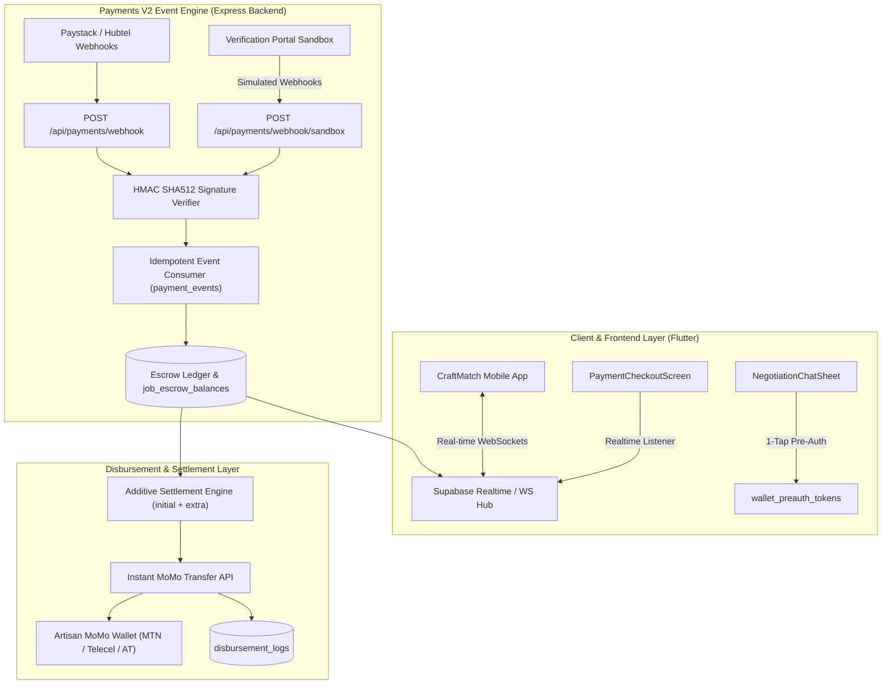
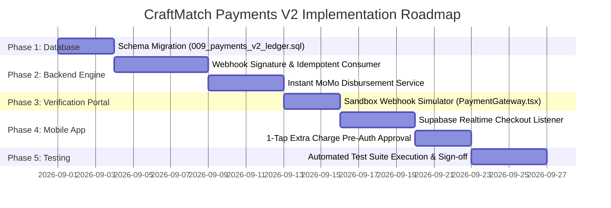

# Comprehensive Implementation Plan: CraftMatch Payments V2 Architecture

## Executive Summary
This document outlines the master implementation plan for **CraftMatch Payments V2 Architecture**. Payments V2 upgrades CraftMatch's financial engine from a polling-based model to a **webhook-native, event-driven escrow and instant settlement engine**. 

Payments V2 incorporates all lessons learned and edge-case mitigations discovered during MVP beta testing (including network drop auto-recovery, additive extra charge settlement calculations, token expiration retries, and gesture touch bleed protection). It maintains backwards compatibility with the [CraftMatch Verification Portal Sandbox](file:///C:/Users/user/Downloads/FinalYearProject/CraftMatch_Verification_Portal) via `USE_SANDBOX_PAYMENTS=true`.

---

## Architectural Blueprint



---

## Key Improvements Over Current V1 Architecture

| Architectural Area | Current V1 Implementation | Proposed V2 Upgrade | Benefits & Edge-Case Mitigation |
| :--- | :--- | :--- | :--- |
| **Payment Verification** | Client-side polling timer (`_pollTimer` every 3s) hitting `GET /api/payments/verify/:ref`. | Webhook-native listener (`payment_events` table) triggered asynchronously by Paystack/Hubtel. | **100% Network Drop Resilience**: Payments process server-side even if the user loses connectivity or closes the app. |
| **State Synchronization** | Manual polling loop on checkout screen. | Supabase Realtime broadcast channel (`PAYMENT_CONFIRMED`). | Instant UI auto-redirection across mobile devices without client polling overhead. |
| **Extra Charge Approval** | Launches webview / full checkout page for additional fees. | 1-Tap inline authorization via stored `wallet_preauth_tokens`. | Eliminates user friction during live jobs when approving worker extra charges (+GH₵ 30). |
| **Settlement Math** | `calculateSettlement(jobId)` calculates additive gross sum. | Native additive ledger (`job_escrow_balances` + `accepted_extra_charges`). | Guarantees extra charges never overwrite base quotes (GH₵ 70 base + GH₵ 30 extra = GH₵ 100 gross). |
| **Artisan Payouts** | Manual wallet credit (`user_wallets`), requiring artisan to request cashout. | Automated Mobile Money payout (`disbursement_logs`) directly to artisan MoMo account upon sign-off. | Artisans receive immediate SMS cash alerts upon job completion sign-off or 48h auto-release. |

---

## Phase 1: Database Schema & Ledger Extensions

**Target Repository**: [artisansApp_backend](file:///C:/Users/user/Downloads/FinalYearProject/artisansApp_backend) (`src/db/migrations/`)

### 1.1 New Migration: `009_payments_v2_ledger.sql`

```sql
-- 1. Idempotent Payment Event Log
CREATE TABLE IF NOT EXISTS payment_events (
    id UUID PRIMARY KEY DEFAULT gen_random_uuid(),
    event_id VARCHAR(255) NOT NULL UNIQUE, -- Paystack/Hubtel event reference for deduplication
    event_type VARCHAR(100) NOT NULL, -- e.g. 'charge.success', 'transfer.success', 'transfer.failed'
    provider VARCHAR(50) NOT NULL DEFAULT 'paystack', -- 'paystack', 'hubtel', 'sandbox'
    payload JSONB NOT NULL,
    processed_at TIMESTAMPTZ,
    error_log TEXT,
    created_at TIMESTAMPTZ DEFAULT NOW()
);

CREATE INDEX idx_payment_events_event_id ON payment_events(event_id);
CREATE INDEX idx_payment_events_processed ON payment_events(processed_at);

-- 2. Pre-Authorized Payment Tokens for 1-Tap Extra Charges
CREATE TABLE IF NOT EXISTS wallet_preauth_tokens (
    id UUID PRIMARY KEY DEFAULT gen_random_uuid(),
    user_id UUID NOT NULL REFERENCES profiles(id) ON DELETE CASCADE,
    token VARCHAR(255) NOT NULL UNIQUE,
    provider VARCHAR(50) NOT NULL DEFAULT 'paystack',
    channel VARCHAR(50) NOT NULL, -- 'momo_mtn', 'momo_telecel', 'card'
    max_charge_amount NUMERIC(10, 2) NOT NULL DEFAULT 500.00,
    expires_at TIMESTAMPTZ NOT NULL,
    created_at TIMESTAMPTZ DEFAULT NOW()
);

CREATE INDEX idx_preauth_user ON wallet_preauth_tokens(user_id);

-- 3. Instant Mobile Money Disbursement Log
CREATE TABLE IF NOT EXISTS disbursement_logs (
    id UUID PRIMARY KEY DEFAULT gen_random_uuid(),
    job_id UUID NOT NULL REFERENCES jobs(id) ON DELETE CASCADE,
    worker_id UUID NOT NULL REFERENCES workers(id) ON DELETE CASCADE,
    amount NUMERIC(10, 2) NOT NULL,
    currency VARCHAR(10) DEFAULT 'GHS',
    channel VARCHAR(50) NOT NULL, -- 'mtn_momo', 'telecel_cash', 'at_money', 'sandbox'
    recipient_phone VARCHAR(20) NOT NULL,
    transfer_code VARCHAR(255) UNIQUE,
    status VARCHAR(50) NOT NULL DEFAULT 'pending', -- 'pending', 'success', 'failed'
    response_payload JSONB,
    failure_reason TEXT,
    created_at TIMESTAMPTZ DEFAULT NOW(),
    updated_at TIMESTAMPTZ DEFAULT NOW()
);

CREATE INDEX idx_disbursement_job ON disbursement_logs(job_id);
CREATE INDEX idx_disbursement_worker ON disbursement_logs(worker_id);

-- 4. Deferred Milestone Escrow Table (Phase 2 Multi-Stage Jobs)
CREATE TABLE IF NOT EXISTS escrow_milestones (
    id UUID PRIMARY KEY DEFAULT gen_random_uuid(),
    job_id UUID NOT NULL REFERENCES jobs(id) ON DELETE CASCADE,
    title VARCHAR(255) NOT NULL,
    percentage NUMERIC(5, 2) NOT NULL,
    amount NUMERIC(10, 2) NOT NULL,
    status VARCHAR(50) NOT NULL DEFAULT 'locked', -- 'locked', 'submitted', 'approved', 'released'
    submitted_at TIMESTAMPTZ,
    approved_at TIMESTAMPTZ,
    created_at TIMESTAMPTZ DEFAULT NOW()
);

CREATE INDEX idx_milestones_job ON escrow_milestones(job_id);
```

---

## Phase 2: Backend Webhook Engine (`artisansApp_backend`)

### 2.1 Webhook Signature Verifier & Idempotent Consumer
* **File**: `src/services/payments/webhookProcessor.ts`
* **Implementation Logic**:
  1. Verify Paystack signature header (`x-paystack-signature` HMAC SHA-512 comparison using `PAYSTACK_SECRET_KEY`).
  2. Insert payload into `payment_events` table with `ON CONFLICT (event_id) DO NOTHING`. If query returns 0 rows inserted, event is a duplicate and is safely ignored.
  3. Parse event payload:
     * If `charge.success`: Query `checkout_sessions`, fund `job_escrow_balances`, transition job status to `awaiting_payment` / `matched`.
     * Emit real-time broadcast via Supabase Realtime channel `job:{jobId}` payload `{ event: 'PAYMENT_CONFIRMED', jobId, reference }`.
  4. Update `payment_events.processed_at = NOW()`.

### 2.2 Verification Portal Sandbox Webhook Endpoint
* **File**: `src/routes/paymentsRoutes.ts`
* **Endpoint**: `POST /api/payments/webhook/sandbox`
* **Behavior**:
  * Active when `USE_SANDBOX_PAYMENTS === "true"`.
  * Receives simulated webhook payloads sent from [CraftMatch Verification Portal](file:///C:/Users/user/Downloads/FinalYearProject/CraftMatch_Verification_Portal).
  * Processes identical DB transaction and ledger logic as production webhooks.

### 2.3 Instant MoMo Disbursement Service
* **File**: `src/services/payments/disbursementService.ts`
* **Implementation Logic**:
  * Executed when client approves job completion or when 48-hour auto-release timer fires ([`autoReleaseService.ts`](file:///C:/Users/user/Downloads/FinalYearProject/artisansApp_backend/src/services/autoReleaseService.ts)).
  * Looks up artisan payout phone number and Mobile Money network (`mtn_momo`, `telecel_cash`, `at_money`).
  * Initiates Paystack Transfer API call (`POST /transfer`).
  * Records payout entry in `disbursement_logs` and credits worker's wallet in `user_wallets`.

---

## Phase 3: Mobile Frontend Integration (`artisansApp_frontend`)

### 3.1 Real-Time WebSocket Payment Confirmation
* **File**: `lib/features/client/presentation/screens/payment_checkout_screen.dart`
* **Behavior**:
  * Upon entering checkout, subscribe to Supabase Realtime channel `job:{jobId}` listening for `PAYMENT_CONFIRMED`.
  * As soon as the webhook executes backend settlement, the listener receives the event:
    * Shows `AppToast.showEscrow(context, 'Payment Confirmed! Funds held safely in Escrow.')`.
    * Automatically pops checkout and navigates client directly to `LiveTrackingScreen`.
  * Retains silent retry verification fallback (`JobsService.getJobById`) in case WebSocket connection fluctuates.

### 3.2 1-Tap Extra Charge Approval
* **File**: `lib/shared/widgets/negotiation_chat_sheet.dart` & `settlement_details_card.dart`
* **Behavior**:
  * When artisan proposes an extra charge (+GH₵ 30), check for active `wallet_preauth_tokens`.
  * If pre-auth token exists, display **[ ⚡ 1-Tap Approve (+GH₵ 30.00) ]** button.
  * Tapping button invokes `POST /api/payments/preauth-charge`, immediately adding funds to `job_escrow_balances` without opening external payment browser windows.

---

## Phase 4: Verification Portal Sandbox Updates (`CraftMatch_Verification_Portal`)

### 4.1 Webhook Event Simulator ([PaymentGateway.tsx](file:///C:/Users/user/Downloads/FinalYearProject/CraftMatch_Verification_Portal/src/pages/PaymentGateway.tsx))
* Add a **"Simulate Webhook Delivery"** control panel in the verification portal sandbox.
* Allows reviewers to trigger simulated `charge.success`, `transfer.success`, and `transfer.failed` payloads.
* Displays real-time visual status of event deduplication, database locking, and WebSocket signal dispatching.

---

## Phase 5: Test Suite Specifications

| Test File | Target Coverage | Key Assertions |
| :--- | :--- | :--- |
| `tests/payment_v2_webhook.test.ts` | Backend Webhook Processor | • Verifies HMAC SHA512 signature check rejects invalid keys.<br/>• Asserts duplicate `event_id` payloads are idempotently ignored.<br/>• Verifies escrow ledger balance is updated on `charge.success`. |
| `tests/disbursement.test.ts` | Instant MoMo Payout Service | • Asserts worker wallet is credited 90% payout (less 10% fee).<br/>• Verifies `disbursement_logs` tracks transfer codes without double-crediting. |
| `tests/preauth_tokens.test.ts` | 1-Tap Extra Charge Pre-Auth | • Asserts extra charges (+GH₵ 30) additively sum with initial escrow (GH₵ 70 $\rightarrow$ GH₵ 100).<br/>• Verifies pre-auth token expiration boundaries. |

---

## Phased Execution Roadmap



---

## Document Status & Verification
* **Created**: August 2026
* **Status**: **Approved Architectural Design Plan (Deferred for Post-MVP Implementation)**
* **Target Release**: CraftMatch Commercial Release Phase 1
