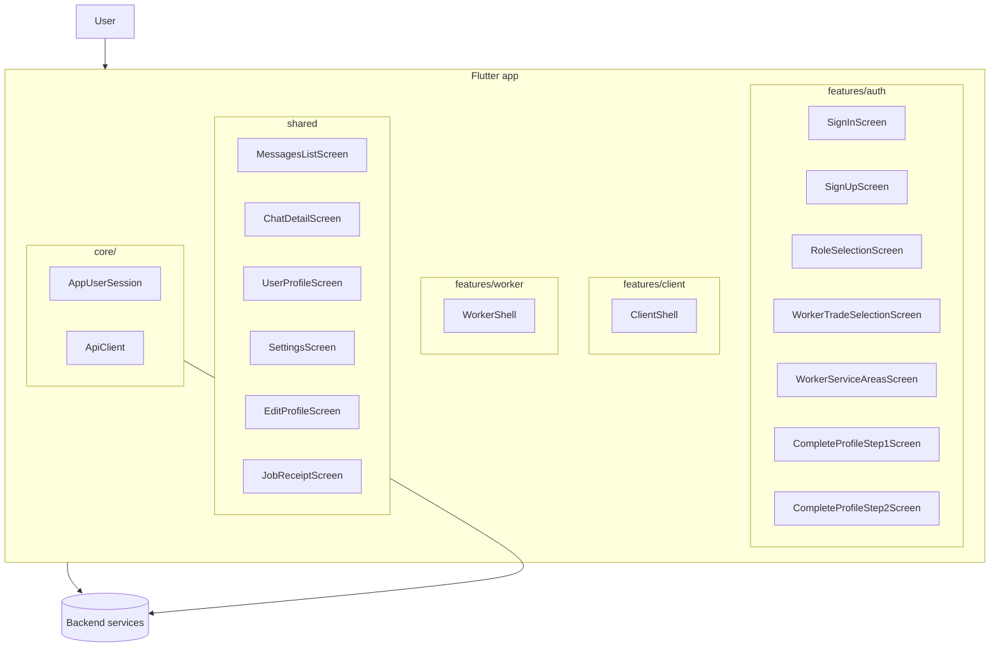

## Backend integration plan (auth + shared + role-aware shells)

This document explains **how to wire the current Flutter UI** to a real backend (Supabase/API + Express/Node or similar), based on the latest auth and shared flows.

It complements:
- `docs/SHARED_HANDOFF_PLAN.md` – ownership and route-level contracts
- `docs/UX_FLOW_VERIFY_PLAN.md` – UX flow + UI fidelity verification
- `Artisans_Organized_ui/**` – visual reference PNGs

The goal is that **client**, **worker**, and **shared** teams can integrate with a backend in a consistent way, without changing the user-facing flows we already shipped.

---

## 1. High-level architecture



Key ideas:
- **`core/` owns session + HTTP client**, not `auth` or `shared`.
- **`features/auth` writes** to `AppUserSession` when the user signs in / completes onboarding.
- **`shared` screens read** from `AppUserSession` via a small helper (today `SharedUserContext`).
- **`features/client` and `features/worker`** (Nhyira / Peniel) own their shells and domain API calls (jobs, bookings, stats, etc.), but they reuse shared models and widgets.

See also:
- `lib/core/network/api_client.dart`
- `lib/shared/utils/shared_user_context.dart`
- `docs/SHARED_HANDOFF_PLAN.md` (Section 4: “Contracts for teammates”)

---

## 2. Session and identity

### 2.1 Current UI-only state

Today, we have:
- `lib/features/auth/models/onboarding_session.dart` – **UI-phase** singleton capturing:
  - `role`, `fullName`, `phone`
  - worker trades, service areas, experience band
  - photo/bio proxies (`locationLabel`, `bio`, `hourlyRateNote`)
- `lib/shared/utils/shared_user_context.dart` – reads from `OnboardingSession` + `SharedStubData` and builds a `UserProfileViewData` for the current user, used by:
  - `UserProfileScreen`
  - `SettingsScreen`
  - `EditProfileScreen`

This is deliberately *frontend-only* and uses stub data (`lib/shared/data/shared_stub_data.dart`).

### 2.2 Target backend-aware session (`core/session`)

When wiring a real backend, move these concerns into `core/`:

```dart
// lib/core/session/app_user_session.dart
class AppUserSession {
  AppUserSession._();
  static final AppUserSession instance = AppUserSession._();

  String? accessToken; // Supabase/JWT or session cookie token
  AppUser? currentUser;

  bool get isAuthenticated => accessToken != null && currentUser != null;

  Future<void> clear() async {
    accessToken = null;
    currentUser = null;
  }
}

class AppUser {
  final String id;
  final String email;
  final String? phone;
  final UserRole role; // shared/models/user_profile_view.dart
  final String? fullName;
  final String? avatarUrl;
  final String? bio;
  final String? locationLabel;
  final List<String> trades;
  final List<String> serviceAreas;
  final String? experienceBand;

  // factory AppUser.fromJson(Map<String, dynamic> json) ...
}
```

**Integration steps:**
1. **Auth backend** (Supabase, custom API, etc.) returns:
   - access token (JWT or session)
   - user metadata including **role** and profile fields.
2. `SignInScreen` and `SignUpScreen`:
   - after successful API call, **set** `AppUserSession.instance.accessToken` and `currentUser`.
   - only then navigate to `RoleSelectionScreen` or shells.
3. Replace usages of `OnboardingSession` in `SharedUserContext` with the authoritative `AppUserSession` (see below).

Refer back to:
- `docs/SHARED_HANDOFF_PLAN.md` – Section 5 (Phase 1: Extract session to `core`)

---

## 3. Auth flows → backend endpoints

### 3.1 Sign-up (`SignUpScreen`)

File: `lib/features/auth/presentation/screens/sign_up_screen.dart`

**UI data:**
- Full name, email, optional phone, password, TOS checkbox.

**Backend integration plan:**
1. Call `POST /auth/sign-up` (or Supabase sign-up) with:
   - `email`, `password`
   - `full_name`, `phone`
2. On success:
   - store token + `AppUser` in `AppUserSession`.
   - if backend already collects **role** during sign-up, include it; otherwise we rely on `RoleSelectionScreen`.
3. Error handling:
   - map backend error codes to inline form errors (email taken, weak password).

### 3.2 Sign-in (`SignInScreen`)

File: `lib/features/auth/presentation/screens/sign_in_screen.dart`

**Backend integration plan:**
1. Call `POST /auth/sign-in` with email + password.
2. On success:
   - store token + `AppUser` in `AppUserSession`.
   - if `currentUser.role` is already set, **skip** role selection and go directly to the correct shell (see Section 4).
3. Map “invalid credentials” and “user not found” to snackbars / form messages.

### 3.3 Onboarding & profile completion

Files:
- `RoleSelectionScreen`
- `WorkerTradeSelectionScreen` (PNG 06)
- `WorkerServiceAreasScreen` (PNG 07)
- `CompleteProfileStep1Screen` / `CompleteProfileStep2Screen` (PNG 08 equivalent)

**Backend data model:**
- A `profiles` table / collection keyed by `user_id`:
  - `role` (`client` | `worker`)
  - `photo_url`
  - `location_label`
  - `bio`
  - `trades` (array)
  - `service_areas` (array)
  - `experience_band`

**Integration approach:**
1. Use `OnboardingSession` as a **temporary buffer** while user is filling forms.
2. At the end of `CompleteProfileStep2Screen._finishProfile()`:
   - send a single `PATCH /profiles/me` (or RPC) with all gathered fields.
   - update `AppUserSession.currentUser` from the response.
3. Future improvement: stream profile changes to shared screens via state management (Riverpod, Provider, Bloc).

See also:
- `docs/UX_FLOW_VERIFY_PLAN.md` – for which fields appear per step and how they map to mocks 06/07/08.

---

## 4. Post-auth navigation and shells

Currently:
- `CompleteProfileStep2Screen` computes:
  - client → `ClientShell.routeName`
  - worker → `WorkerShell.routeName`
- `ClientShell` and `WorkerShell` use shared screens (`MessagesListScreen`, `UserProfileScreen`, `SettingsScreen`) embedded in their tab content.

**Backend implication:**
- Once shells load, they should **fetch initial data** based on `AppUserSession.currentUser`:
  - client home: recommended jobs, bookings, explore list.
  - worker home: incoming requests, earnings, booking history, stats.
- The shared messages and chat screens will rely on a **message service** (see below).

To keep this wiring flexible:
- Add a small `onAuthComplete(BuildContext, AppUser)` function in `core/navigation` (see `docs/SHARED_HANDOFF_PLAN.md`, Phase 2) that:
  - decides whether the user still needs onboarding or goes straight to shell.
  - routes based on `AppUser.role`.

---

## 5. Messaging / chat integration

Screens:
- `MessagesListScreen` (`/shared/messages`)
- `ChatDetailScreen` (`/shared/chat`)

Reference PNGs:
- `Artisans_Organized_ui/shared/50_messages_list.png`
- `Artisans_Organized_ui/shared/51_chat_detail.png`

### 5.1 Data model

At minimum:
- `conversations`:
  - `id`
  - `job_id` (nullable)
  - `participant_ids` (client id, worker id)
  - `last_message`, `last_message_at`, `unread_count_for_client`, `unread_count_for_worker`
- `messages`:
  - `id`
  - `conversation_id`
  - `sender_id`
  - `content`
  - `created_at`
  - `image_urls` (array of strings, optional)
  - status flags (`delivered`, `read_at`)

### 5.2 API surface

Suggested endpoints (or equivalent Supabase RPCs):
- `GET /conversations?role=currentRole` → list used by `MessagesListScreen`.
- `GET /conversations/{id}/messages` → initial chat history.
- `POST /conversations/{id}/messages` → send new message.
- Optional: websocket / real-time channel for new messages.

### 5.3 Wiring into existing screens

`MessagesListScreen`:
- Replace `SharedStubData.conversations` with a repository call:
  - `ConversationRepository.fetchForCurrentUser(role)`.
- Use `FutureBuilder` / state notifier for loading/error states.

`ChatDetailScreen`:
- In `didChangeDependencies`, currently reads stub messages:
  - `SharedStubData.messagesForConversation(routeArgs.conversationId)`.
- Swap to:
  - `MessageRepository.watchConversation(conversationId)` (stream or polling).
- `_sendMessage` should:
  - optimistic-add a local message to the list.
  - call `POST /conversations/{id}/messages`.
  - update read-status if the screen is open.

Use `docs/UX_FLOW_VERIFY_PLAN.md` to ensure:
- the flow from messages → chat → profile still behaves as designed.

---

## 6. Profiles, settings, and edit profile

Shared screens:
- `UserProfileScreen` (`/shared/profile`, PNG 52)
- `SettingsScreen` (`/shared/settings`, PNG 53 + 65)
- `EditProfileScreen` (`/shared/edit-profile`, PNG 64)

### 6.1 Profile fetching

For **own profile**, `UserProfileScreen` currently calls:
- `SharedUserContext.resolveProfile(args)` which:
  - checks `isOwnProfile(args.userId)` and uses stub + session.

With backend:
- For **own user**:
  - read directly from `AppUserSession.currentUser`.
  - optionally refresh from `GET /profiles/me` on pull-to-refresh.
- For **other user** (viewing artisan / client):
  - call `GET /profiles/{userId}`.

The mapper from backend JSON → `UserProfileViewData` should live in `shared/models/` or `core/models/`.

### 6.2 Edit profile

`EditProfileScreen` captures:
- client: name, locked phone, location, bio.
- worker: + skills, service areas, hourly rate note, primary location.

Backend wiring:
- Call `PATCH /profiles/me` with edited fields.
- On success:
  - update `AppUserSession.currentUser`.
  - notify interested listeners (shared profile, settings, shells).

### 6.3 Settings

`SettingsScreen` has:
- Client body (hero, community, premium, legal, logout).
- Worker body (account preferences, low data mode, legal, logout).

Backend wiring:
- Notification prefs:
  - `PATCH /settings/notifications` (push, email, low data).
- Logout:
  - call backend logout (if needed).
  - clear `AppUserSession` and any refresh tokens.

Use `docs/SHARED_HANDOFF_PLAN.md` for the role-conditional expectations.

---

## 7. Jobs, bookings, and receipts (worker + client)

Relevant shared screen:
- `JobReceiptScreen` (`/shared/job-receipt`, PNG 66)

Worker mock PNGs:
- `Artisans_Organized_ui/worker/4x_*.png` (requests, active, completion).

**Backend entities:**
- `jobs` / `bookings` table with:
  - client id, worker id
  - status (requested, accepted, in_progress, completed, cancelled)
  - pricing and time spent
  - description and photos

**Integration targets:**
- `JobReceiptScreen`:
  - currently uses `SharedStubData.sampleJobReceipt`.
  - should take a `jobId` route arg and fetch `GET /jobs/{jobId}/receipt`.
- Worker shell screens (already owned by worker feature):
  - `WorkerRequestsScreen` – `GET /worker/jobs?status=requested`.
  - `WorkerActive...` screens – `GET /worker/jobs/active`.
  - `WorkerBookingHistoryScreen` – `GET /worker/jobs?status=completed`.
  - `WorkerEarningsScreen` / `WorkerStatsScreen` – aggregated endpoints.

Refer to:
- `features/worker/presentation/screens/*` and the PNGs in `Artisans_Organized_ui/worker/`.

---

## 8. Client-side error handling and loading patterns

Across all flows, align on:
- **Loading states:**
  - messages list skeletons
  - button `isLoading` flags (already present on `GradientButton`).
- **Error surfacing:**
  - form-field errors when validation is local.
  - snackbars for network/server errors.
- **Retry:**
  - pull-to-refresh on lists (messages, bookings).
  - “Try again” buttons where appropriate.

These patterns should be the same regardless of backend provider.

Use `docs/UX_FLOW_VERIFY_PLAN.md` to sanity-check that adding network states does not break navigation or layouts.

---

## 9. Sequence of backend work (recommended)

1. **Auth + session (core)**
   - Implement `/auth/sign-in`, `/auth/sign-up`.
   - Build `AppUserSession` in `core/session`.
   - Update auth screens to call backend and fill session.
2. **Profiles + settings**
   - Implement `/profiles/me`, `/profiles/{id}`, `/settings/notifications`.
   - Wire `UserProfileScreen`, `EditProfileScreen`, `SettingsScreen`.
3. **Messaging**
   - Implement conversations + messages endpoints.
   - Replace `SharedStubData` usage in `MessagesListScreen` and `ChatDetailScreen`.
4. **Jobs / receipts**
   - Implement job/booking APIs.
   - Wire `JobReceiptScreen` and worker/client booking history screens.
5. **Refine shells**
   - Fetch initial data for `ClientShell` and `WorkerShell` dashboards.

Each step can be developed and tested independently using the UX plans in:
- `docs/UX_FLOW_VERIFY_PLAN.md`
- `docs/SHARED_HANDOFF_PLAN.md`

