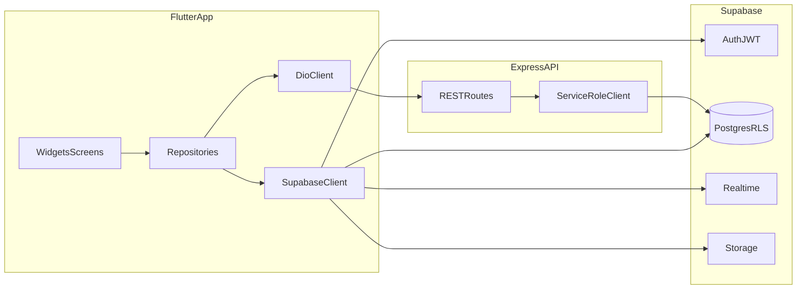

# Backend Integration Plan (Flutter + Supabase + Express)

This document is a **future execution guide** for wiring the Artisans Flutter app to **Supabase** (auth, Postgres, Realtime, Storage) and **Express.js** (matching, notifications, privileged writes), aligned with the **Artisans Project Checklist**, **FRONTEND STRUCTURE AND RULES**, and architectural discipline from the **BOA Master Technical Document** (repository pattern, resilience).

It is intentionally separate from [shared_implementation.md](shared_implementation.md) (UI-first work). Execute this plan **after** UI shells and navigation contracts exist.

---

## 1. Goals and non-goals

### 1.1 Goals

- Single authenticated user journey: **Supabase Auth** (email/password per current product direction) produces a **JWT** usable by Flutter and Express.
- Flutter reads/writes user-scoped data through **Supabase client** where RLS allows; calls Express for **matching, job lifecycle, FCM-side effects** using the same JWT.
- **Realtime** subscriptions for tables Peniel enables (`jobs`, `workers`, `messages` per checklist).
- **Storage** for avatars and job photos per checklist buckets.
- Observable **errors, retries, offline** behavior per checklist Phase 3 themes.

### 1.2 Non-goals (until explicitly scheduled)

- MoMo payments, WhatsApp dispatch, USSD (checklist **Future** section).
- Replacing Supabase with a custom auth server.

---

## 2. Architecture overview

**Principle (from BOA-style thinking):** UI never imports `supabase_flutter` directly except at the composition root; **repositories** encapsulate queries and map DTOs to domain models.

---

## 3. Prerequisites and configuration

### 3.1 Secrets and env (team process)

- **Never commit** Supabase URL/anon key, Express base URL, or service keys (checklist: shared password manager).
- Flutter: use `--dart-define` or flavor-specific config (coordinate with Nhyira). Document required keys in a team-internal runbook (not in public repo if course policy forbids).

### 3.2 Supabase project (Peniel)

Checklist Phase 1A expectations relevant to integration:

- Schema: `profiles`, `workers`, `categories`, `jobs`, `job_applications`, `reviews`, `messages`, etc.
- **RLS on every table**; policies for `profiles`, `workers`, `jobs`, `messages` as described in checklist.
- **Realtime** enabled where checklist specifies (`jobs`, `workers`, `messages`).
- **Storage buckets**: `avatars`, `job-photos`, `id-docs` with size limits.
- Generated types: `supabase gen types typescript` on backend; Flutter side may use `supabase_flutter` + hand-written Dart models or codegen—coordinate one approach.

### 3.3 Express API (Kwabena backend repo)

Checklist Phase 1B: JWT verification middleware, structured errors, rate limiting, matching services, FCM notifications.

Flutter needs:

- **Base URL** for Express (dev/staging/prod).
- **OpenAPI or Postman** collection (checklist: Postman in `/api/postman/`) for contract tests.

---

## 4. Flutter bootstrap sequence

### 4.1 Dependencies (checklist-aligned)

Add under team review:

- `supabase_flutter`
- `dio` (checklist mentions Dio + interceptors)
- `flutter_riverpod` + `riverpod_annotation` (if adopted)
- `go_router`
- `firebase_messaging` + `flutter_local_notifications` (when FCM phase starts)
- `connectivity_plus` (offline banner)
- `cached_network_image`, `intl`, etc.

### 4.2 `main.dart` initialization order

1. `WidgetsFlutterBinding.ensureInitialized()`
2. `Supabase.initialize(url: ..., anonKey: ...)`
3. Firebase initialization when FCM is integrated (Android/iOS config files per checklist).
4. `runApp` with `ProviderScope` if using Riverpod.

### 4.3 Session restoration

- On startup, read existing Supabase session; route to home vs auth (Nhyira owns router; document redirect rules here).
- Listen to `Supabase.instance.client.auth.onAuthStateChange` for mid-session sign-out and token refresh failures (checklist: session expired → login without crash).

---

## 5. Auth integration (email + password)

### 5.1 Sign up / sign in

- Map auth UI to `signUp` / `signInWithPassword` (or equivalent) per final auth UX.
- **Phone numbers** remain profile fields, not OTP auth unless product changes—persist to `profiles.phone` after signup or in profile completion flow.

### 5.2 Profile row creation

- Ensure `profiles` row exists on first login (trigger on Supabase side preferred; else Flutter upsert once—coordinate with Peniel to avoid duplicates).

### 5.3 Logout (Settings screen handoff)

- Call `Supabase.instance.client.auth.signOut()`.
- Clear local caches (Riverpod invalidation, any cached Dio auth header).
- Navigate to auth stack (router owner implements).

---

## 6. HTTP client for Express (`dio_client`)

### 6.1 Base configuration

- Base URL from environment.
- Timeouts appropriate for Ghana mobile networks (BOA “Africa mode” mindset: generous timeouts + retries).

### 6.2 JWT interceptor

Checklist Phase 1C / Phase 2 integration tasks:

- Attach `Authorization: Bearer <supabase_access_token>` on every Express request.
- On `401`, attempt **silent refresh** of Supabase session if SDK supports; otherwise sign out gracefully.

### 6.3 Retry interceptor

Checklist: **3 attempts**, exponential backoff (500ms, 1s, 2s) for failed requests—implement in Dio `Interceptor` (idempotent GETs safer than POSTs; document which endpoints are retry-safe).

### 6.4 Error shape

Checklist Phase 3: Express returns structured JSON `{ error: string, code: string }`—map to user-facing snackbars and developer logs.

---

## 7. Supabase data access patterns

### 7.1 Reads (RLS-protected)

Examples (exact columns per Peniel migrations):

- `profiles`: current user row only (typical RLS).
- `workers`: discovery reads as policy allows.
- `jobs`: client sees own jobs; worker sees matched jobs per checklist.

### 7.2 Writes

- Prefer **Express + service_role** for operations checklist assigns to Kwabena (job create, accept, matching side effects) to keep complex rules server-side.
- Direct Supabase writes from Flutter only where RLS explicitly allows simple user-owned updates (e.g. profile fields)—confirm with Peniel per table.

### 7.3 Realtime subscriptions

- **Jobs**: client “searching” screen listens for status transitions (checklist).
- **Workers**: tracking screen listens to worker location updates.
- **Messages**: chat thread listens to `messages` for a given `job_id` (when chat is enabled).

Implementation notes:

- Use unique channels and cancel subscriptions on `dispose`.
- Handle reconnect: resubscribe on app resume if needed.

### 7.4 Storage uploads

- Avatars → `avatars` bucket; job photos → `job-photos` with checklist size limits.
- Use signed upload policies as configured by Peniel; show upload progress and compress images before upload (checklist Phase 3 image guidance).

---

## 8. Feature-to-backend mapping (reference checklist)

Use this as a routing table when wiring each feature folder (owners must implement their own screens; this doc is for **contracts**):

| Concern | Layer | Owner |
| ------- | ----- | ----- |
| Auth session | Supabase Auth | Kwabena auth UI + shared bootstrap |
| Profile CRUD | Supabase `profiles` | Shared profile + auth completion |
| Nearby workers | Express `GET /api/workers/nearby` | Client feature (Nhyira) |
| Job create/cancel/complete | Express POST/PUT routes | Client/worker flows |
| Worker location ping | Express `PUT /api/workers/location` | Worker feature |
| Matching notifications | FCM via Express | Backend + device tokens on `profiles` |
| Chat messages | Supabase `messages` + RLS | Shared chat when Phase 2 prioritized |

Adjust paths to match final Express router mounted in the team’s `api` repo.

---

## 9. FCM and `profiles.fcm_token`

Checklist: store **FCM token** on profile.

- Request notification permission at appropriate time (not during cold auth unless product requires).
- On token refresh, update `profiles.fcm_token` via allowed update path.
- Handle permission denied without blocking core flows.

---

## 10. Testing and verification matrix (from checklist themes)

### 10.1 Integration “all three layers” (Phase 2 checklist)

- Flutter authenticates; JWT present.
- Flutter calls Express with JWT → `200`.
- Express writes with service role without unintended RLS blocks on server path.
- Realtime event reaches Flutter when Express updates a row (exact table per test plan).

### 10.2 Security spot checks

- Attempt cross-user reads from Flutter; expect **empty** or error per RLS (Peniel validates).

### 10.3 Resilience

- Airplane mode during request → offline banner + retry behavior.
- Mid-session token expiry → redirect to login, no crash.

---

## 11. Rollout phases (backend wiring)

| Phase | Deliverable |
| ----- | ----------- |
| **B1** | `Supabase.initialize` + session listener + env wiring |
| **B2** | Profile read/write + avatar upload to `avatars` |
| **B3** | Dio client + JWT interceptor + one ping endpoint smoke test |
| **B4** | Realtime: subscribe to one table in a debug screen, then integrate into real UI |
| **B5** | Job lifecycle endpoints consumed by client/worker owners (coordinate PRs) |
| **B6** | FCM token pipeline + device test on MTN/Vodafone if available |

---

## 12. Documentation and handoff artifacts

- Link Express Postman collection from backend repo.
- Maintain a short **integration changelog** when endpoints or RLS change (avoid silent Flutter breaks).
- ER diagram and architecture diagram ownership per checklist Phase 4 (team).

---

## 13. Open coordination items (fill in before B1)

- Final Express **base URL** naming and environments.
- Whether **any** job writes are allowed from Flutter directly vs always Express.
- Version pins for `supabase_flutter` / `dio` agreed with Nhyira.

When these are resolved, mark them here and tick off phases in section 11.
