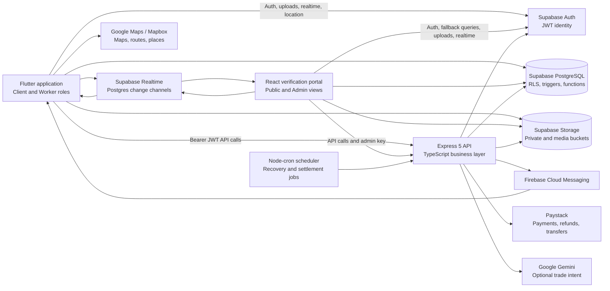

# CraftMatch System Architecture

**Status:** Implemented architecture documented from the backend, Flutter application, and verification portal repositories.

CraftMatch is a Ghana-focused, on-demand services marketplace. It has one Flutter application with client and worker roles, a React web portal for public verification journeys and administrators, an Express API for transactional business logic, and Supabase as the shared data platform.

## 1. Context and Container Architecture

### Architectural style

- **Client applications:** Feature-based Flutter and React clients with shared domain models and UI components.
- **API layer:** Express routes are thin entry points; services own business rules and database operations.
- **Data platform:** Supabase combines PostgreSQL, authentication, row-level security, object storage, and realtime database events.
- **Integration layer:** The backend isolates FCM, Paystack, Gemini, and scheduled jobs from the clients.
- **Hybrid access:** Clients use the API for business transactions, and connect directly to Supabase for authentication, realtime subscriptions, and selected uploads/location updates.

## 2. Runtime Components

### Flutter marketplace application

The mobile and multi-platform client starts at `lib/main.dart` and composes the application in `lib/app.dart`.

- **Core:** Supabase session management, API client, storage, realtime, location, notifications, caching/offline support, maps, navigation, and shared utilities.
- **Client role:** Create jobs, discover/request workers, receive quotes, negotiate, pay, track work, chat, confirm completion, review workers, and manage wallet activity.
- **Worker role:** Complete onboarding and verification, manage skills and availability, receive dispatches/applications, accept jobs, navigate, check in, upload completion evidence, negotiate, and manage earnings.
- **Shared features:** Profiles, conversations, messages, settings, job receipts, notifications, and trust-and-safety reporting.

The API client attaches the Supabase access token as a Bearer token to the Express API. Supabase Storage handles media such as avatars, job photos, chat media, completion evidence, verification documents, and report evidence.

### Express backend

The backend is a Node.js/TypeScript Express service. `src/server.ts` starts the HTTP server and scheduler; `src/app.ts` configures CORS, Helmet, rate limiting, JSON parsing, API documentation, health checks, routing, and global errors.

The route registry mounts modules for profiles, categories, jobs, workers, reviews, chat, notifications, pricing, search, trades, verification, administration, payments, payouts, wallet, releases, reports, disputes, and negotiations. Protected routes validate Supabase JWTs in authentication middleware; administrator routes use the verification-admin authorization boundary.

The service layer contains the main domain logic:

| Domain | Responsibilities |
| --- | --- |
| Jobs and dispatch | Job lifecycle, applications, worker assignment, idempotency, matching, recommendations, and dispatch recovery |
| Workers | Profiles, capabilities, availability, GPS freshness, active jobs, check-ins, and worker history |
| Search and pricing | Trade-intent extraction, category aliases, base pricing, quotes, extra charges, and recommendations |
| Negotiation | Protected client/worker quote rounds, accepted quotes, and checkout session creation |
| Payments | Paystack initialization/verification, escrow, ledger entries, payouts, refunds, reconciliation, and auto-release |
| Communication | Conversations, messages, realtime payloads, persisted notifications, and FCM delivery |
| Trust and safety | Verification, reports, evidence, blocks, disputes, moderation, and immutable audit events |

### React verification portal

The Vite/React/TypeScript portal uses hash-based routing. It provides public landing, application, status, support, payment, policy, and download pages, plus protected administrative views for dashboards, applications, document review, audit logs, reports, service catalog, accounts, and settings.

Its data access first uses the Express API with `VITE_EXPRESS_API_BASE_URL`. The implemented client also has a Supabase fallback for direct queries and mutations. Verification documents are private and are exposed to authorized reviewers through signed URLs, not public bucket URLs.

## 3. Supabase Data Platform

### Identity and authorization

Supabase Auth is the identity provider. The Flutter application authenticates users and sends the resulting JWT to Express. Express validates the token with Supabase Auth, loads the associated profile, and rejects suspended accounts. Supabase RLS policies protect direct client access to database rows and storage objects.

### Main data domains

| Domain | Representative tables |
| --- | --- |
| Identity and marketplace | `profiles`, `workers`, `categories`, `subcategories` |
| Jobs and lifecycle | `jobs`, `job_applications`, `job_dispatches`, `job_cancellations`, `job_completion_details` |
| Communication | `messages`, `direct_conversations`, `notifications`, `notification_devices` |
| Verification | `worker_verifications`, `verification_documents`, `verification_references`, `verification_handoffs`, `verification_audit_logs`, `admin_users` |
| Commercial flows | `negotiations`, `negotiation_rounds`, `checkout_sessions`, `payments`, `payment_idempotency_keys`, `job_escrow_balances`, `escrow_ledger`, `worker_payout_details`, `job_extra_charges` |
| Trust and safety | `reports`, `report_audit_logs`, `user_blocks`, disputes, and moderation fields on profiles |
| Quality | `reviews` and worker rating/statistics fields |

Database migrations enforce lifecycle constraints, idempotency, realtime publication, storage policies, payment hardening, protection against double active worker jobs, and synchronization of verification state to worker visibility.

### Storage buckets

The platform uses `avatars`, `job-photos`, `chat-media`, `completion-photos`, `verification-docs`, and `report-evidence`. Public profile media and sensitive evidence have different access policies; verification and report evidence remain private.

Realtime publications cover jobs, workers, messages, dispatches, notifications, negotiations, negotiation rounds, checkout sessions, and extra charges. This supports live job status, worker tracking, chat, quote updates, payment state, and verification status views.

## 4. Key Data Flows

### Authentication

1. A user signs in through Supabase Auth.
2. The client receives a Supabase access token and uses it for Express calls.
3. Express validates the token, loads the profile and role, and applies suspension and role checks.
4. Direct Supabase reads, subscriptions, and storage operations are additionally constrained by RLS and storage policies.

### Job matching and execution

1. A client submits a job through Express; the request may include photos, schedule, location, category, and idempotency data.
2. The backend persists the job and derives category/pricing information.
3. Matching scores available workers using distance, capabilities, rating, verification, location freshness, response behavior, and fairness rules.
4. Candidate dispatches are persisted and delivered through FCM and realtime events.
5. An atomic acceptance lock prevents conflicting worker assignments.
6. The job progresses through booking, travel, arrival/check-in, work, completion, client confirmation or dispute, and final settlement states.

### Negotiation, escrow, and settlement

1. Client and worker exchange protected quote rounds through the negotiation service.
2. An accepted quote creates or updates a checkout session.
3. Paystack or the supported sandbox checkout records payment status through API callbacks/webhooks.
4. The backend records escrow and double-entry wallet movements, including extra charges and platform/worker settlement splits.
5. Reconciliation and the 48-hour auto-release process run from the scheduler, with idempotency and audit records protecting retries.

### Tracking, chat, and notifications

- Worker location updates are written during active work and published through Supabase Realtime for the client map.
- Messages are persisted through the API, while realtime subscriptions update open conversations immediately.
- Media is uploaded to the relevant storage bucket.
- The backend persists role-aware notifications and sends background push notifications through Firebase Cloud Messaging.

### Verification

1. A worker requests a short-lived verification handoff from the Flutter app.
2. The portal exchanges the handoff for worker context and accepts application details, references, and document uploads.
3. Administrators review the application and documents, then approve, reject, or request more information.
4. Every administrative action is audited; approval synchronizes the worker's verified state used by discovery and matching.

### Trust and safety

Users can block other users and submit reports with evidence. The backend stores the report workflow and audit trail, while administrators moderate reports and accounts. Suspension state is enforced again during API authentication, so moderation is not only a portal-side UI decision.

## 5. Security and Operational Boundaries

- Supabase Auth is the source of identity; Express does not issue a second session-token system.
- Service-role Supabase credentials and Firebase credentials belong only in backend/server environments.
- Browser/mobile clients use anon keys, JWTs, RLS, and scoped storage policies.
- Sensitive files use private buckets and signed URLs.
- Express applies Helmet, CORS, body-size limits, rate limiting, input validation, centralized errors, and idempotency checks.
- Payment, verification, moderation, and settlement actions produce durable audit records.
- The scheduler handles stale dispatch recovery, reminders, payment reconciliation, and escrow auto-release; these operations are designed to be repeatable.

## 6. Deployment View

The Flutter project produces mobile and desktop/web targets. The React portal is a Vite application deployable as a static web client. The Express backend is deployed as a Node.js service and exposes `/api`, health endpoints, OpenAPI documentation, and the app-release manifest endpoint. Supabase, Firebase, Paystack, Gemini, and mapping providers remain managed external services connected through their respective client or backend SDKs.

## 7. Source-of-Truth Notes

This document describes the implemented repositories. The backend `ARCHITECTURE.md` is a useful API reference but is older than the current service set: the current code does not use a separate controller directory and includes payments, negotiation, trust-and-safety, releases, and portal fallback behavior. For implementation changes, prefer the route/service code and Supabase migrations as the source of truth.
